# Các mục chính trong bài hướng dẫn (kèm link đến mục): {#các-mục-chính-trong-bài-hướng-dẫn-kèm-link-đến-mục .unnumbered}

**Main Sections in the User Guide (with links to each section):**

[[Các mục chính trong bài hướng dẫn (kèm link đến
mục):]{.underline}](#các-mục-chính-trong-bài-hướng-dẫn-kèm-link-đến-mục)

[[1. Hướng dẫn tích hợp Facebook vào tin nhắn đa
kênh]{.underline}](#hướng-dẫn-tích-hợp-facebook-vào-tin-nhắn-đa-kênh)

[[(Guide to Integrating Facebook into Multi-channel
Messaging)]{.underline}](#guide-to-integrating-facebook-into-multi-channel-messaging)

> [[1.1. Bước 1: Truy cập vào trang Tích hợp
> Facebook]{.underline}](#bước-1-truy-cập-vào-trang-tích-hợp-facebook)
>
> [[(Step 1: Access the Facebook Integration
> Page)]{.underline}](#step-1-access-the-facebook-integration-page)
>
> [[1.2. Bước 2: Tại trang Tích hợp Facebook, click nút Tích
> hợp]{.underline}](#bước-2-tại-trang-tích-hợp-facebook-click-nút-tích-hợp)

[[(Step 2: On the Facebook Integration page, click the Integrate
button.)]{.underline}](#step-2-on-the-facebook-integration-page-click-the-integrate-button.)

> [[1.3. Dùng tài khoản Admin của page để tích
> hợp]{.underline}](#dùng-tài-khoản-admin-của-page-để-tích-hợp)

[2. Hướng dẫn thiết lập Fanpage Facebook trên
AntCRM](#hướng-dẫn-thiết-lập-fanpage-facebook-trên-antcrm)

> [2.1. Thêm Hỗ trợ:](#thêm-hỗ-trợ)

[[(Adding support:)]{.underline}](#adding-support)

> [2.2. Cấu hình phân công](#cấu-hình-phân-công)

[3. Hướng dẫn quản lý chat với khách hàng
Facebook](#hướng-dẫn-quản-lý-chat-với-khách-hàng-facebook)

[[(Guide to Managing Facebook Chats with
Customers)]{.underline}](#guide-to-managing-facebook-chats-with-customers)

> [3.1. Hướng dẫn gửi tin nhắn cho khách
> hàng](#hướng-dẫn-gửi-tin-nhắn-cho-khách-hàng)
>
> [[(Guide to Sending Messages to
> Customers)]{.underline}](#guide-to-sending-messages-to-customers)
>
> [[3.2. Hướng dẫn Xem lịch sử hội
> thoại]{.underline}](#hướng-dẫn-xem-lịch-sử-hội-thoại)
>
> [[(Guide to Viewing Conversation
> History)]{.underline}](#guide-to-viewing-conversation-history)

[4. Hướng dẫn quản lý comment
Facebook](#hướng-dẫn-quản-lý-comment-facebook)

[[(Guide to Managing Facebook
Comments)]{.underline}](#guide-to-managing-facebook-comments)

> [4.1. Hướng dẫn bình luận hỗ trợ khách
> hàng](#hướng-dẫn-bình-luận-hỗ-trợ-khách-hàng)
>
> [[(Customer Support Commenting
> Guide)]{.underline}](#customer-support-commenting-guide)
>
> [4.2. Hướng dẫn ẩn bình luận](#hướng-dẫn-ẩn-bình-luận)
>
> [[(Guide to Hiding Comments)]{.underline}](#guide-to-hiding-comments)
>
> [4.3. Hướng dẫn chỉnh sửa bình luận](#hướng-dẫn-chỉnh-sửa-bình-luận)
>
> [[(Guide to Editing
> Comments)]{.underline}](#guide-to-editing-comments)
>
> [4.4. Hướng dẫn xóa bình luận](#hướng-dẫn-xóa-bình-luận)
>
> [[(Guide to Deleting
> Comments)]{.underline}](#guide-to-deleting-comments)
>
> [[4.5. Hướng dẫn Like/Unlike bình
> luận]{.underline}](#hướng-dẫn-likeunlike-bình-luận)
>
> [[(Guide to Liking/Unliking
> Comments)]{.underline}](#guide-to-likingunliking-comments)

[[5. Hướng dẫn quản lý bài Post của
trang]{.underline}](#hướng-dẫn-quản-lý-bài-post-của-trang)

[[(Guide to Managing Page
Posts)]{.underline}](#guide-to-managing-page-posts)

> [[(Guide to see more
> comments)]{.underline}](#guide-to-see-more-comments)
>
> [[5.2. Hướng dẫn trả lời bình
> luận]{.underline}](#hướng-dẫn-trả-lời-bình-luận)
>
> [[(Guide to answer the
> comment)]{.underline}](#guide-to-answer-the-comment)
>
> [[5.3. Hướng dẫn xem bài viết,bình luận trên
> facebook]{.underline}](#hướng-dẫn-xem-bài-viếtbình-luận-trên-facebook)
>
> [[(Guide to Viewing Posts and Comments on
> Facebook)]{.underline}](#guide-to-viewing-posts-and-comments-on-facebook)

[6. Hướng dẫn thay đổi người phụ trách
session](#hướng-dẫn-thay-đổi-người-phụ-trách-session)

[[(Guide to Changing the Session
Owner)]{.underline}](#guide-to-changing-the-session-owner)

[[7. Hướng dẫn thêm user hỗ trợ vào một session tin nhắn, bình
luận:]{.underline}](#hướng-dẫn-thêm-user-hỗ-trợ-vào-một-session-tin-nhắn-bình-luận)

[[(Guide to Adding a Support User to a Message or Comment
Session)]{.underline}](#guide-to-adding-a-support-user-to-a-message-or-comment-session)

[[8. Hướng dẫn gắn nhãn cho
session]{.underline}](#hướng-dẫn-gắn-nhãn-cho-session)

[[(Guide to Tagging a
Session)]{.underline}](#guide-to-tagging-a-session)

[9. Hướng dẫn gửi hình ảnh](#hướng-dẫn-gửi-hình-ảnh)

[[(Guide to Sending Images)]{.underline}](#guide-to-sending-images)

[[10. Hướng dẫn Đánh dấu Xong cho
session]{.underline}](#hướng-dẫn-đánh-dấu-xong-cho-session)

[[(Guide to Marking a Session as
Done)]{.underline}](#guide-to-marking-a-session-as-done)

[[11. Làm thế nào để thêm mẫu tin nhắn Omni và sử dụng
chúng?]{.underline}](#làm-thế-nào-để-thêm-mẫu-tin-nhắn-omni-và-sử-dụng-chúng)

[[(How to Add and Use Omni Message
Templates?)]{.underline}](#how-to-add-and-use-omni-message-templates)

> [[11.1. Hướng dẫn thêm/ sửa/ xóa mẫu tin nhắn
> Omni]{.underline}](#hướng-dẫn-thêm-sửa-xóa-mẫu-tin-nhắn-omni)
>
> [[(Guide to Add/Edit/Delete Omni Message
> Templates)]{.underline}](#guide-to-addeditdelete-omni-message-templates)
>
> [[11.1.1. Hướng dẫn thêm mẫu tin
> nhắn]{.underline}](#hướng-dẫn-thêm-mẫu-tin-nhắn)
>
> [[(Guide to Adding a Message
> Template)]{.underline}](#guide-to-adding-a-message-template)
>
> [[11.1.2. Hướng dẫn chỉnh sửa mẫu tin
> nhắn]{.underline}](#hướng-dẫn-chỉnh-sửa-mẫu-tin-nhắn)
>
> [[(Guide to Editing a Message
> Template)]{.underline}](#guide-to-editing-a-message-template)
>
> [[11.1.3. Hướng dẫn xóa mẫu tin
> nhắn]{.underline}](#hướng-dẫn-xóa-mẫu-tin-nhắn)
>
> [[(Guide to Deleting a Message
> Template)]{.underline}](#guide-to-deleting-a-message-template)
>
> [[11.2. Hướng dẫn sử dụng mẫu tin nhắn
> Omni]{.underline}](#hướng-dẫn-sử-dụng-mẫu-tin-nhắn-omni)
>
> [[(Omni Message Template User
> Guide)]{.underline}](#omni-message-template-user-guide)

[[12. Hướng dẫn thiết lập thời gian đóng
session?]{.underline}](#hướng-dẫn-thiết-lập-thời-gian-đóng-session)

[[(Guide to Setting Up Session
Timeout)]{.underline}](#guide-to-setting-up-session-timeout)

[[13. Hướng dẫn cấu hình thời gian chờ thay đổi người phụ trách khi chưa
trả lời
session:]{.underline}](#hướng-dẫn-cấu-hình-thời-gian-chờ-thay-đổi-người-phụ-trách-khi-chưa-trả-lời-session)

> [[(Guide to Configuring the Timeout for Changing the Assignee When
> There Is No Response to the
> Session)]{.underline}](#guide-to-configuring-the-timeout-for-changing-the-assignee-when-there-is-no-response-to-the-session)

[[14. Hướng dẫn Thiết lập tự động trả lời và gửi tin nhắn trên
FB]{.underline}](#hướng-dẫn-thiết-lập-tự-động-trả-lời-và-gửi-tin-nhắn-trên-fb)

[[(Guide to Setting Up Auto-Reply and Sending Messages on
Facebook)]{.underline}](#guide-to-setting-up-auto-reply-and-sending-messages-on-facebooky)

[[15. Hướng dẫn Thiết lập thời hạn phản hồi và cảnh báo trước khi hết
hạn phản hồi cho session
Omni]{.underline}](#hướng-dẫn-thiết-lập-thời-hạn-phản-hồi-và-cảnh-báo-trước-khi-hết-hạn-phản-hồi-cho-session-omni)

[[(Guide to Setting Up Response Time and Pre-Expiration Warnings for
Omni
Sessions)]{.underline}](#guide-to-setting-up-response-time-and-pre-expiration-warnings-for-omni-sessions)

[16. Các thao tác với khách hàng](#các-thao-tác-với-khách-hàng)

[[(Customer operations)]{.underline}](#customer-operations)

[[17. Hướng dẫn đánh dấu chưa
đọc]{.underline}](#hướng-dẫn-đánh-dấu-chưa-đọc)

[[(Guide to marking as
unread)]{.underline}](#guide-to-marking-as-unread)

[[18. Hướng dẫn thiết lập Danh mục hội
thoại]{.underline}](#hướng-dẫn-thiết-lập-danh-mục-hội-thoại)

[[(Guide to setting up Omnichannel chat
Categories)]{.underline}](#guide-to-setting-up-omnichannel-chat-categories)

[[19. Hướng dẫn cấu hình Cấu hình hiển
thị]{.underline}](#hướng-dẫn-cấu-hình-cấu-hình-hiển-thị)

[[(Guide to configuring
layout)]{.underline}](#guide-to-configuring-layout)

#  {#section .unnumbered}

# Hướng dẫn tích hợp Facebook vào tin nhắn đa kênh 

#  *(Guide to Integrating Facebook into Multi-channel Messaging)* {#guide-to-integrating-facebook-into-multi-channel-messaging .unnumbered}

## 1.1. Bước 1: Truy cập vào trang Tích hợp Facebook {#bước-1-truy-cập-vào-trang-tích-hợp-facebook .unnumbered}

##  *(Step 1: Access the Facebook Integration Page)* {#step-1-access-the-facebook-integration-page .unnumbered}

> Cách 1: Trên thanh menu trái, Click **quản lý tin nhắn** -\> chọn
> **tin nhắn đa kênh**
>
> Chọn tab Facebook, click nút tích hợp
>
> *( Method 1: In the left menu bar, click on Message Management -\>
> select Multi-channel Messaging*
>
> *Go to the Facebook tab, then click the Integrate button.)*
>
> 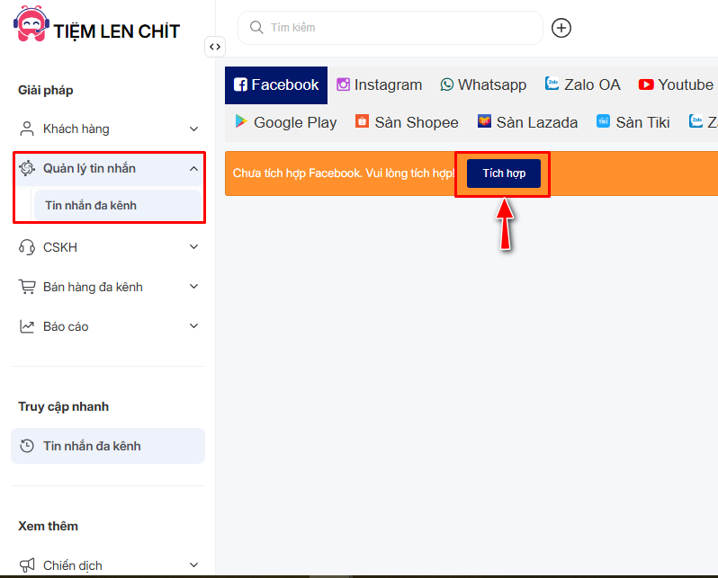{width="6.5in"
> height="5.236111111111111in"}
>
> 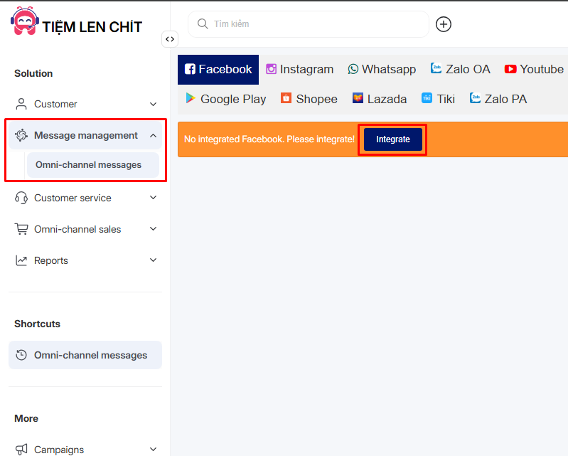{width="6.5in"
> height="5.208333333333333in"}
>
> Cách 2: Vào trang **Thiết lập** =\> Chọn **Thiết lập hội thoại đa
> kênh** =\> Chọn **Tích hợp Facebook**
>
> *(Method 2: Go to the Settings page =\> Select Multi-channel
> Conversation Settings =\> Choose Facebook Integration)*

## 1.2. Bước 2: Tại trang Tích hợp Facebook, click nút **Tích hợp** {#bước-2-tại-trang-tích-hợp-facebook-click-nút-tích-hợp .unnumbered}

#  *(Step 2: On the Facebook Integration page, click the Integrate button.)* {#step-2-on-the-facebook-integration-page-click-the-integrate-button. .unnumbered}

> 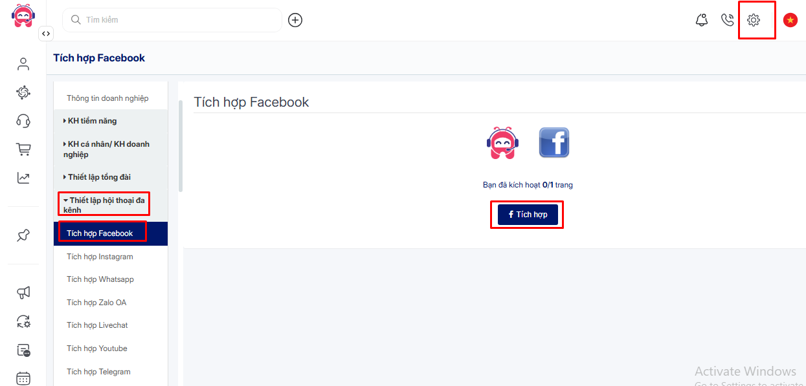{width="6.5in"
> height="3.111111111111111in"}
>
> 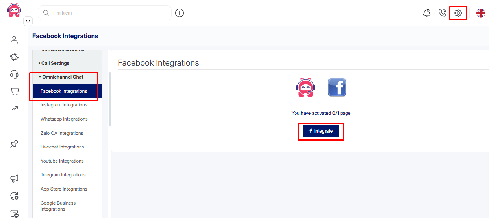{width="6.5in"
> height="2.9027777777777777in"}

## **1.3.** Dùng tài khoản Admin của page để tích hợp {#dùng-tài-khoản-admin-của-page-để-tích-hợp .unnumbered}

*(Use the Admin account of the page to integrate.)*

> Có 2 trường hợp:
>
> (*There are two cases:)*
>
> Trường hợp 1: Nếu bạn chưa đăng nhập Facebook, khi click nút Tích hợp,
> trang sẽ mở một hộp thoại yêu cầu đăng nhập Facebook. Bạn phải đăng
> nhập để tích hợp.
>
> Lưu ý: tài khoản đăng nhập phải có ít nhất 1 Fanpage
>
> Nếu tài khoản của bạn chưa có Fanpage, vui lòng tạo Fanpage theo hướng
> dẫn [[tại
> đây]{.underline}](https://docs.google.com/document/d/1_43Ggxz3gbuhyk__1NLfCUM3MxZWnt8SZ6eFxMyqThc/edit?usp=sharing)
>
> *(Case 1: If you are not logged into Facebook, when you click the
> Integrate button, a dialog box will appear asking you to log in to
> Facebook. You must log in to integrate.\
> Note: The account you log in with must have at least one Fanpage.\
> If your account does not have a Fanpage, please create one following
> the instructions
> [[here]{.underline}](https://docs.google.com/document/d/1_43Ggxz3gbuhyk__1NLfCUM3MxZWnt8SZ6eFxMyqThc/edit?usp=sharing))*
>
> 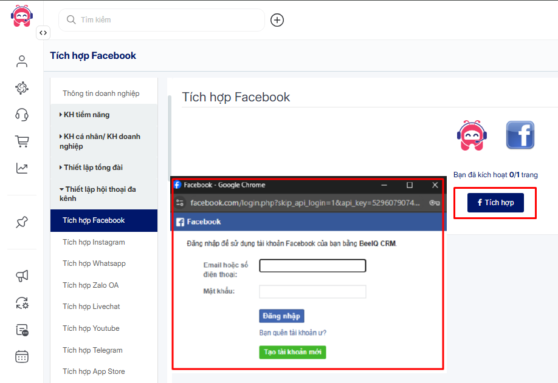{width="6.5in"
> height="4.472222222222222in"}
>
> {width="6.5in"
> height="4.180555555555555in"}
>
> Sau khi đăng nhập, popup xác nhận tiếp tục với tài khoản hiện tại sẽ
> bật lên, Click Tiếp tục dưới tên ...
>
> *(After logging in, a popup confirmation to continue with the current
> account will appear. Click Continue under the name...)*
>
> 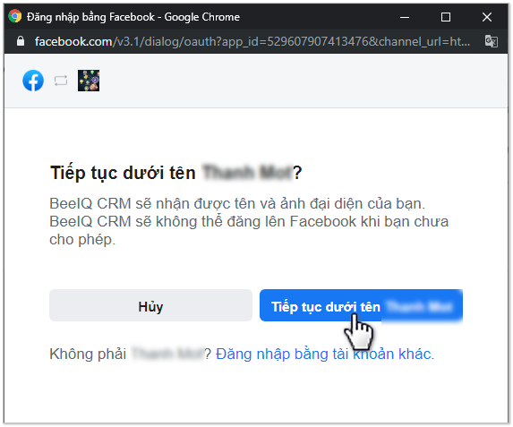{width="5.96875in" height="4.96875in"}
>
> 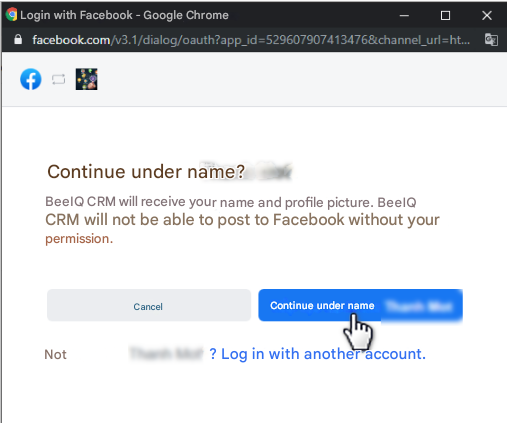{width="5.28125in" height="4.40625in"}
>
> Trường hợp 2: Nếu đã đăng nhập Facebook thì khi click nút Tích hợp,
> popup xác nhận tiếp tục với tài khoản hiện tại sẽ bật lên, click Tiếp
> tục dưới tên ...
>
> *(Case 2: If logged in with Facebook, when clicking the Integration
> button, a popup confirmation to continue with the current account will
> appear. Click Continue under the name ...)*
>
> Lưu ý: Tài khoản hiện tại phải có ít nhất 1 Fanpage, nếu không đúng
> tài khoản cần dùng thì click Đăng nhập bằng tài khoản khác để thực
> hiện đăng nhập lại với đúng tài khoản có Fanpage mong muốn.
>
> *(Note: The current account must have at least one Fanpage. If it is
> not the correct account, click Log in with a different account to log
> in again with the desired account that has the required Fanpage.)*
>
> {width="5.96875in" height="4.96875in"}
>
> {width="5.28125in" height="4.40625in"}
>
> Bước 4. Tick để chọn các trang sẽ dùng để tích hợp vào AntCRM, click
> Tiếp tục
>
> *(Step 4: Tick to select the pages to be integrated into AntCRM, then
> click Continue.)*
>
> Khi tích hợp thành công, màn hình sẽ hiện thông báo "Tích hợp Facebook
> thành công!" và các trang của bạn sẽ hiện ra
>
> *(When the integration is successful, a message "Facebook integration
> successful!" will appear, and your pages will be displayed.)*
>
> 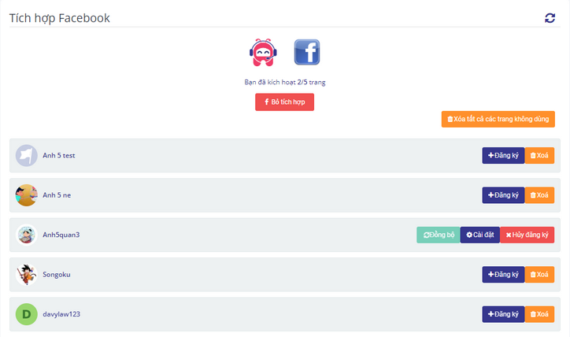{width="6.5in"
> height="3.8472222222222223in"}
>
> 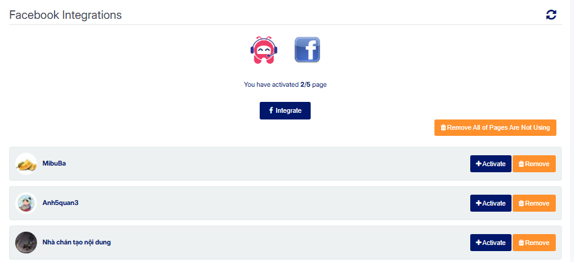{width="6.5in"
> height="2.9722222222222223in"}
>
> Bước 5: Chọn trang mà bạn muốn đăng ký, click nút Đăng ký
>
> Dưới đây là màn hình đăng ký thành công.
>
> *(Step 5: Select the page you want to register, then click the
> Register button. Below is the screen showing successful
> registration.)*
>
> 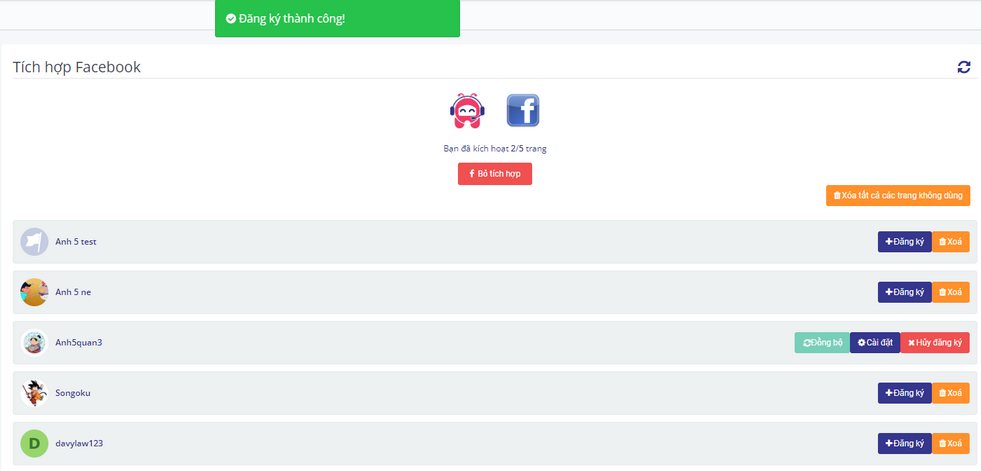{width="6.5in" height="3.125in"}
>
> 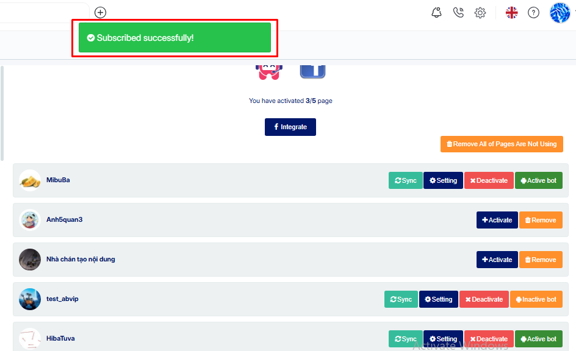{width="6.5in"
> height="3.9722222222222223in"}

# 2. Hướng dẫn thiết lập Fanpage Facebook trên AntCRM {#hướng-dẫn-thiết-lập-fanpage-facebook-trên-antcrm .unnumbered}

*(Guide to Setting Up Facebook Fanpage on AntCRM)*

Bước 1: Đi đến trang Thiết lập hội thoại đa kênh - Tích hợp Facebook

*(**Step 1:** Go to the Multi-Channel Conversation Setup page - Facebook
Integration.)*

Bước 2: Click nút **Cài đặt** tại chính page (đã đăng ký) mà bạn muốn
thiết lập

*(**Step 2:** Click the **Settings** button on the page (already
registered) that you want to set up.)*

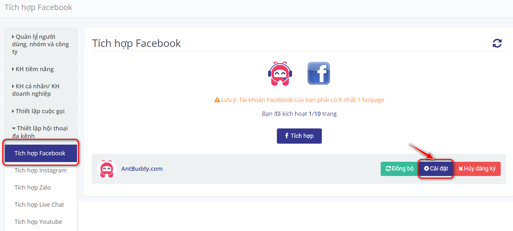{width="6.5in"
height="2.9305555555555554in"}

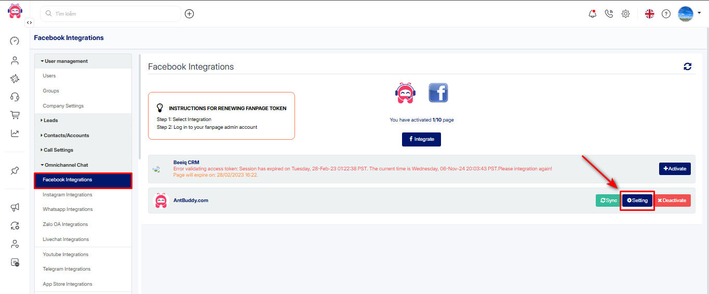{width="6.5in"
height="2.6944444444444446in"}

Trang sẽ chuyển hướng đến trang thiết lập cho Fanpage

*(The page will be redirected to the setup page for the Fanpage.)*

{width="6.5in"
height="1.9583333333333333in"}

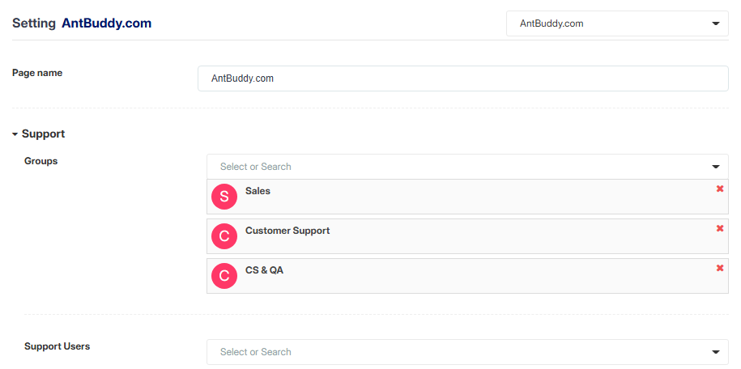{width="6.5in"
height="3.236111111111111in"}

Thiết lập cho Fanpage gồm có các mục sau:

*(The setup for the FanPage includes the following sections:)*

+-------------------------+--------------------------------------------+
| Mục                     | Mô tả                                      |
|                         |                                            |
| *(Sessions)*            | *(Description)*                            |
+=========================+============================================+
| Nhóm                    | Danh sách nhóm sẽ chịu trách nhiệm hỗ trợ  |
|                         | khách hàng                                 |
| *(Group)*               |                                            |
|                         | bình luận facebook...                      |
|                         |                                            |
|                         | *(A list of groups responsible for         |
|                         | customer support*                          |
|                         |                                            |
|                         | *Facebook comments...)*                    |
+-------------------------+--------------------------------------------+
| User hỗ trợ             | Danh sách nhân viên chịu trách nhiệm tương |
|                         | tác với khách hàng như Nhận chat facebook, |
| *(Support user)*        | Nhận bình luận                             |
|                         |                                            |
|                         | *(A list of employees responsible for      |
|                         | interacting with customers, such as        |
|                         | receiving Facebook chats, receiving        |
|                         | comments.)*                                |
+-------------------------+--------------------------------------------+
| Mặc định phân công      | Khi bật tính năng này, thì session tự động |
| session của khách hàng  | phân công cho nhân viên phụ trách trước đó |
| cũ đã có nhân viên phụ  | của session, không cần check các điều kiện |
| trách                   | phân công khác. Nếu người phụ trách ss cũ  |
|                         | không có trong danh sách nhân viên được    |
| *(By default, the       | phân công, thì ss này sẽ thành chưa chỉ    |
| session of existing     | định                                       |
| customers will be       |                                            |
| assigned to the         | *(When this feature is enabled, the        |
| employee already        | session will be automatically assigned to  |
| responsible.)*          | the employee who was previously            |
|                         | responsible for the session, without the   |
|                         | need to check other assignment conditions. |
|                         | If the previous responsible person is not  |
|                         | in the list of assigned employees, the     |
|                         | session will be marked as \"not            |
|                         | assigned.\")*                              |
+-------------------------+--------------------------------------------+
| Tự động                 | Khi bật tính năng tự động phân phối, các   |
|                         | bình luận/tin nhắn từ khách hàng gửi vào   |
| phân phối               | Page sẽ được phân phối cho nhân viên hỗ    |
|                         | trợ một cách tự động theo quy tắc được     |
| *(Automatic             | chọn ở Chế độ phân công (được cấu hình ở   |
| distribution)*          | dưới)                                      |
|                         |                                            |
|                         | *(When the automatic distribution feature  |
|                         | is enabled, comments/messages from         |
|                         | customers sent to the Page will be         |
|                         | automatically distributed to support staff |
|                         | according to the rules selected in the     |
|                         | Assignment Mode (configured below).)*      |
+-------------------------+--------------------------------------------+
| Ưu tiên gán cho người   | Khi bật tính năng này, hệ thống sẽ tự động |
| phụ trách của khách     | phân phối session cho người phụ trách của  |
| hàng liên quan          | khách hàng nhắn tin vào (phụ trách         |
|                         | lead/contact). Nếu người phụ trách không   |
| *(Priority will be      | thỏa điều kiện phân phối session, hệ thống |
| given to assigning to   | tự động phân phối theo quy luật phân công  |
| the person responsible  |                                            |
| for the related         | *(When this feature is enabled, the system |
| customer.)*             | will automatically assign the session to   |
|                         | the person responsible for the customer    |
|                         | who sent the message (responsible for the  |
|                         | lead/contact). If the responsible person   |
|                         | does not meet the session distribution     |
|                         | criteria, the system will automatically    |
|                         | distribute the session according to the    |
|                         | assignment rules.)*                        |
+-------------------------+--------------------------------------------+
| Chế độ phân công        | Có 2 chế độ phân công                      |
|                         |                                            |
| *(Assignment Mode)*     | -   Tuần tự: Phân phối phiếu yêu cầu lần   |
|                         |     lượt theo thứ tự các nhân viên trong   |
|                         |     nhóm và xoay vòng.                     |
|                         |                                            |
|                         | -   Ngẫu nhiên: Phân phối phiếu yêu cầu    |
|                         |     một cách ngẫu nhiên cho các nhân viên  |
|                         |     trong nhóm.                            |
|                         |                                            |
|                         | *(There are 2 assignment modes:*           |
|                         |                                            |
|                         | -   ***Sequential:** Distributes the       |
|                         |     request tickets in order to the        |
|                         |     employees in the group and rotates.*   |
|                         |                                            |
|                         | -   ***Random:** Distributes the request   |
|                         |     tickets randomly to the employees in   |
|                         |     the group.)*                           |
+-------------------------+--------------------------------------------+
| Áp dụng cho             | Chỉ nhân viên online: Chỉ phân công        |
|                         | session mới vào cho nhân viên đang online  |
| *(Apply for)*           | CRM                                        |
|                         |                                            |
|                         | Tất cả nhân viên: Phân công mới cho tất cả |
|                         | nhân viên theo chế độ phân công            |
|                         |                                            |
|                         | *(**Only online employees:** Only assigns  |
|                         | new sessions to employees who are          |
|                         | currently online in the CRM.*              |
|                         |                                            |
|                         | ***All employees:** Assigns new sessions   |
|                         | to all employees according to the selected |
|                         | assignment mode.)*                         |
+-------------------------+--------------------------------------------+
| Phân công theo rule tùy | Cho phép tạo Rule phân công theo từ khóa   |
| chọn                    | theo nội dung tin nhắn/ bình luận của      |
|                         | Khách hàng                                 |
| *(Assign according to   |                                            |
| custom rules.)*         | *(Allows creating an assignment rule based |
|                         | on keywords in the customer\'s             |
|                         | message/comment content.)*                 |
+-------------------------+--------------------------------------------+
| Chuyển phụ trách khách  | Khi bật tính năng này,nhân viên phụ trách  |
| hàng khi phân công      | của Khách hàng sẽ chuyển theo nhân viên    |
|                         | được phân công session chat                |
| *(Transfer customer     |                                            |
| responsibility when     | *(When this feature is enabled, the        |
| assigning.)*            | customer's responsible employee will be    |
|                         | transferred to the employee assigned to    |
|                         | the chat session.)*                        |
+-------------------------+--------------------------------------------+
| Quyền xem và tương tác  | Cho phép các user được xem/thao tác nội    |
| với session             | dung session của nhau                      |
|                         |                                            |
| *(Permission to view    | *(Allows users to view/interact with each  |
| and interact with the   | other\'s session content.)*                |
| session)*               |                                            |
+-------------------------+--------------------------------------------+
| Tag:                    | Thẻ được gắn cho khách hàng mới với mục    |
|                         | đích phân biệt, nhóm các khách hàng có     |
| Cấu hình gắn tag cho    | tính chất giống nhau để tiện cho việc thao |
| khách hàng khi có khách | tác sau này                                |
| hàng tạo mới.           |                                            |
|                         | *(The tag is assigned to new customers to  |
| *(**Tag:\               | differentiate and group customers with     |
| **Configure to assign a | similar characteristics, making it easier  |
| tag to the customer     | for future operations.)*                   |
| when a new customer is  |                                            |
| created.)*              |                                            |
+-------------------------+--------------------------------------------+
| Nguồn KH tiềm năng:     | Nguồn tạo ra khách hàng, việc này cũng     |
|                         | nhằm mục đích phân biệt và nhóm các khách  |
| Cấu hình nguồn Lead cho | hàng có tính chất giống nhau.              |
| khách hàng khi có Lead  |                                            |
| được tạo mới.           | *(The source that generates the customer,  |
|                         | which also aims to differentiate and group |
| (***Lead Source:\       | customers with similar characteristics.)*  |
| **Configure the lead    |                                            |
| source for the customer |                                            |
| when a new lead is      |                                            |
| created.)*              |                                            |
+-------------------------+--------------------------------------------+
| Trả lời bình luận bằng  | Cho phép Cấu hình trả lời bình luận bằng   |
| bình luận               | bình luận hoặc bằng tin nhắn               |
|                         |                                            |
| *(Reply to comments     | *(Allows configuring to reply to comments  |
| with comments.)*        | with either a comment or a message.)*      |
+-------------------------+--------------------------------------------+

## 2.1. Thêm Hỗ trợ: {#thêm-hỗ-trợ .unnumbered}

#  *(Adding support:)* {#adding-support .unnumbered}

Bước 1. Đi đến trang Cài đặt Fanpage - mục **Hỗ trợ** (theo hướng dẫn ở
trên)

*(Step 1: Go to the Fanpage Settings page - **Support** section (as per
the instructions above).)*

Bước 2. Chọn hoặc tìm kiếm Nhóm hỗ trợ để thêm vào danh sách hỗ trợ

*(Step 2: Select or search for a Support group to add to support list)*

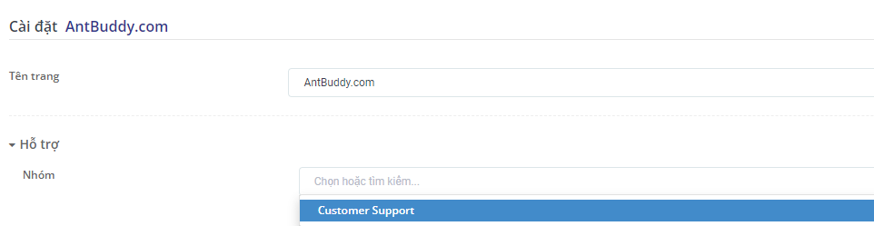{width="6.5in"
height="1.6805555555555556in"}

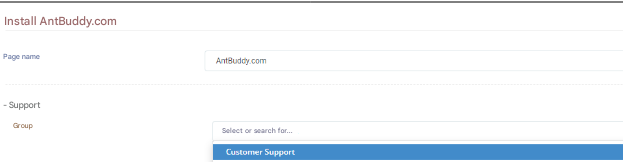{width="6.489583333333333in"
height="1.6875in"}

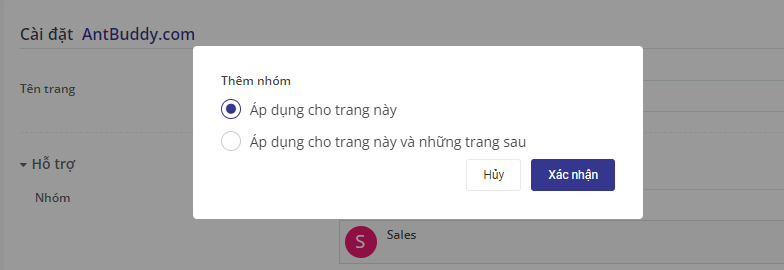{width="6.5in"
height="2.236111111111111in"}

{width="6.5in"
height="2.0833333333333335in"}

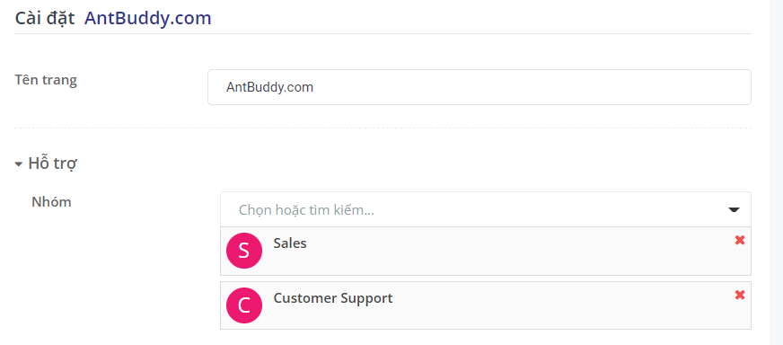{width="6.5in"
height="2.861111111111111in"}

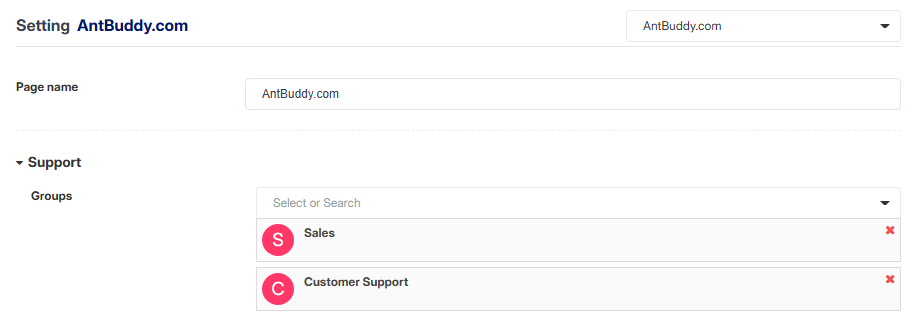{width="6.5in" height="2.25in"}

Bước 3. Chọn hoặc tìm kiếm User hỗ trợ để thêm vào danh sách User hỗ trợ

*(Step 3**:** Select or search for a Support User to add to the support
user list.)*

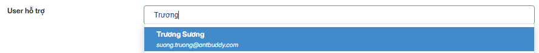{width="6.5in"
height="0.6388888888888888in"}

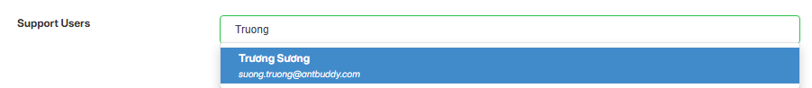{width="6.5in"
height="0.7083333333333334in"}

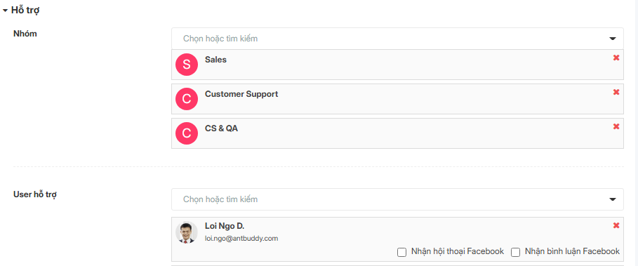{width="6.5in"
height="2.7083333333333335in"}

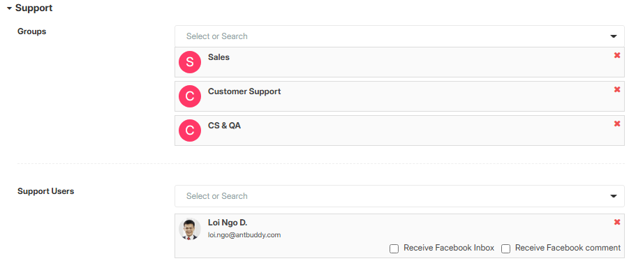{width="6.5in"
height="2.6944444444444446in"}

Nếu muốn xóa user ra khỏi danh sách hỗ trợ, hãy click nút **X**

*(If you want to remove a user from the support list, click the **X**
button.)*

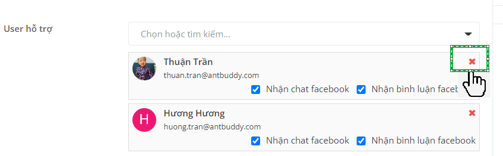{width="6.5in"
height="2.0277777777777777in"}

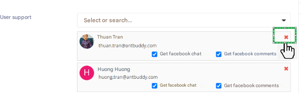{width="6.416666666666667in"
height="1.9791666666666667in"}

Tick hoặc bỏ tick để tùy chỉnh nhận chat Facebook, nhận bình luận
Facebook cho mỗi nhân viên hỗ trợ

*(Tick or untick to customize receiving Facebook chats or Facebook
comments for each support user.)*

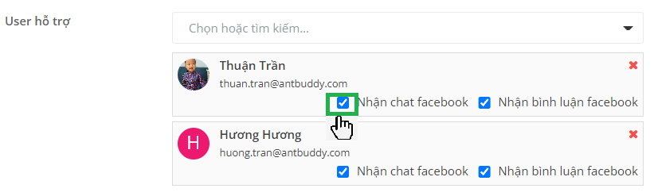{width="6.5in"
height="1.9583333333333333in"}

{width="6.5in" height="1.375in"}

## 2.2. Cấu hình phân công {#cấu-hình-phân-công .unnumbered}

*(Assignment Configuration)*

Bước 1. Đi đến trang Cài đặt Fanpage - mục Cấu hình phân công (theo
hướng dẫn ở trên)

*(Step 1: Go to the Fanpage Settings page - Assignment Configuration
section (as per the instructions above).)*

Bước 2. Bật tính năng Tự động phân phối

*(Step 2: Enable the Automatic* Assign *feature.)*

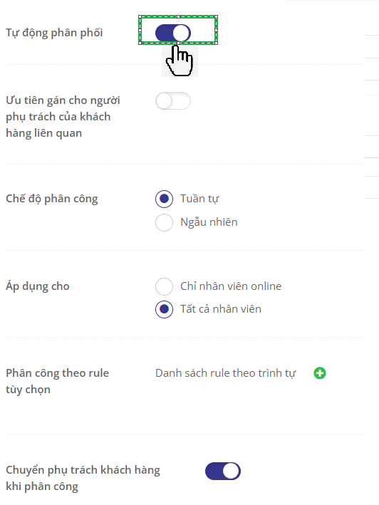{width="5.541666666666667in"
height="7.385416666666667in"}

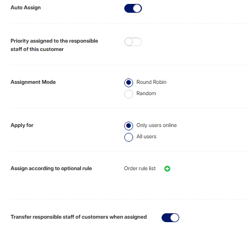{width="5.28125in" height="4.84375in"}

Bước 3: Tick vào Chế độ phân công mong muốn : **Tuần tự** hoặc **Ngẫu
nhiên**

*(Step 3: Tick the desired Assignment Mode: Round robin or Random)*

Tuần tự: Các tin nhắn và bình luận của Fanpage sẽ được tự động phân phối
tuần tự cho các nhân viên trong danh sách user hỗ trợ.

*(Round robin: Messages and comments from the Fanpage will be
automatically distributed in sequence to the support users in the
list.)*

Ngẫu nhiên: Các tin nhắn và bình luận của Fanpage sẽ được tự động phân
phối ngẫu nhiên cho các nhân viên trong danh sách user hỗ trợ.

*(Random: Messages and comments from the Fanpage will be automatically
distributed randomly to the support users in the list.)*

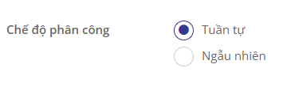{width="3.6979166666666665in"
height="1.1458333333333333in"}

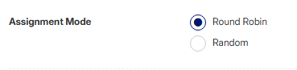{width="3.84375in" height="0.90625in"}

Bước 4. Tùy chọn áp dụng cho nhân viên

*(Step 4: Options apply to employees.)*

-   Chỉ nhân viên online : Chỉ áp dụng phân công cho nhân viên đang
    online

*(Only users online: Applies the assignment only to employees who are
currently online.)*

-   Tất cả nhân viên: Áp dụng phân công cho tất cả nhân viên dù đang
    offline

*(All users: Applies the assignment to all employees, even those who are
offline.)*

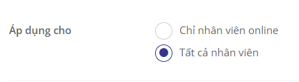{width="4.479166666666667in"
height="1.2291666666666667in"}

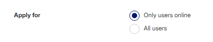{width="4.322916666666667in"
height="0.8645833333333334in"}

Bước 5. Click Lưu

*( Step 5: Click Save)*

2.3. Cấu hình tương tác

*(Interaction Configuration)*

Bước 1. Đi đến trang Cài đặt Fanpage - mục Tương tác (theo hướng dẫn ở
trên)

*(Step 1: Go to the Fanpage Settings page - Interaction section (as per
the instructions above).)*

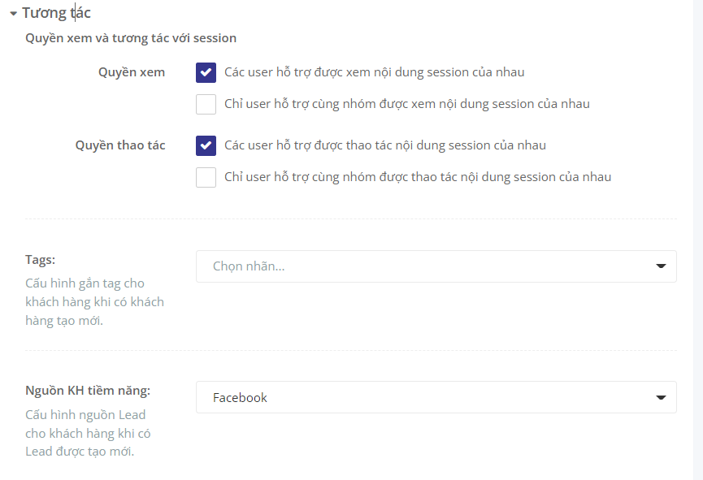{width="6.5in"
height="4.444444444444445in"}

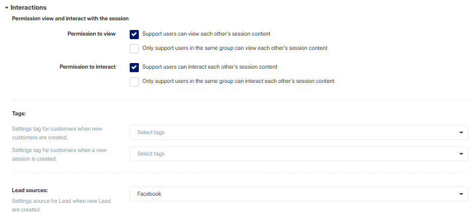{width="6.5in"
height="2.9305555555555554in"}

Bước 2: Thiết lập Quyền xem và tương tác với session:

*(Step 2: Set up Permissions to view and interact with the session:)*

Tick hoặc bỏ tick để tùy chỉnh cấp quyền xem/thao tác cho các nhân viên
hỗ trợ

*(Tick or untick to customize the permission levels for viewing/
interacting with sessions for support employees.)*

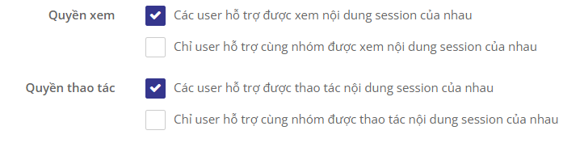{width="6.5in"
height="1.5972222222222223in"}

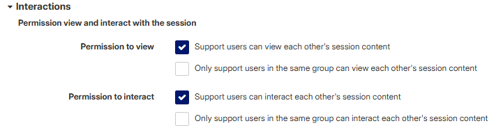{width="6.5in" height="1.75in"}

Bước 3. Chọn thẻ , thẻ được chọn sẽ gắn tự động vào các khách hàng mới
từ Fanpage này

*(Step 3**:** Select a tag. The selected tag will be automatically
assigned to new customers from this Fanpage.)*

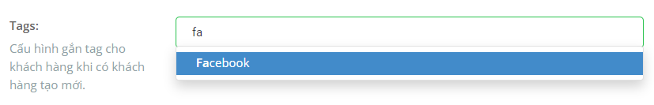{width="6.5in"
height="1.0416666666666667in"}

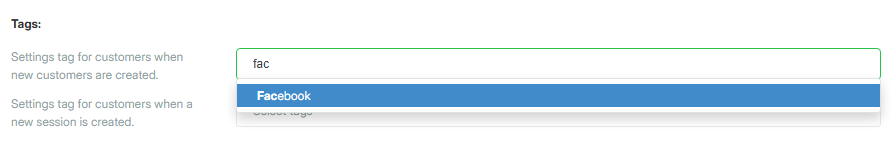{width="6.5in"
height="1.0555555555555556in"}

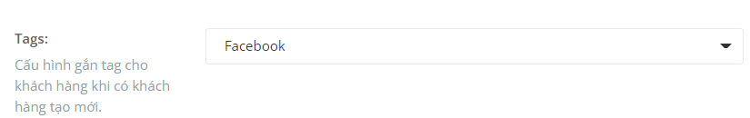{width="6.5in"
height="1.0277777777777777in"}

{width="6.5in"
height="0.6111111111111112in"}

Bước 4. Chọn nguồn , các khách hàng mới từ page này sẽ có nguồn là nguồn
đã chọn

*(Step 4: Select a source. New customers from this page will have the
selected source.)*

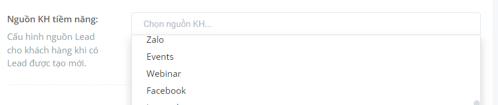{width="6.5in" height="1.375in"}

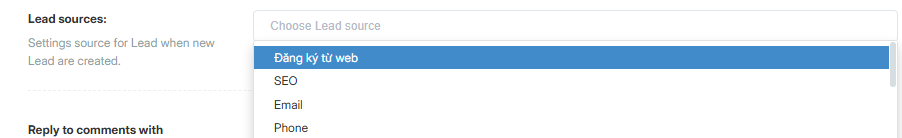{width="6.5in" height="1.0in"}

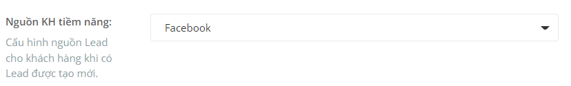{width="6.5in"
height="0.9861111111111112in"}

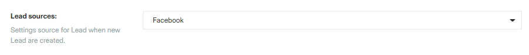{width="6.5in"
height="0.6805555555555556in"}

Bước 5: Thiết lập Trả lời bình luận bằng bình luận

*(Step 5: Set up Reply to comments with comments.)*

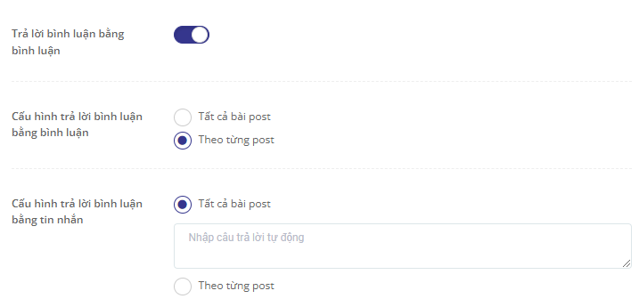{width="6.5in" height="3.125in"}

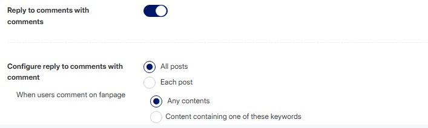{width="6.5in"
height="1.9444444444444444in"}

https://huongdan.antbuddy.com/kb/antcrm-thiet-lap-tu-dong-tra-loi-va-gui-tin-nhan-tren-omni-facebook

Bước 6. Click Lưu

(Step 6: Click Save)

# 3. Hướng dẫn quản lý chat với khách hàng Facebook {#hướng-dẫn-quản-lý-chat-với-khách-hàng-facebook .unnumbered}

#  *(Guide to Managing Facebook Chats with Customers)* {#guide-to-managing-facebook-chats-with-customers .unnumbered}

Khi có một khách hàng nhắn tin vào trang, tin nhắn sẽ được đưa về Omni -
Facebook

Số lượng tin nhắn/comment chưa đọc sẽ được hiển thị ở trên menu.

*(When a customer sends a message to the page, the message will be
directed to Omni - Facebook. The number of unread messages/comments will
be displayed on the menu.)*

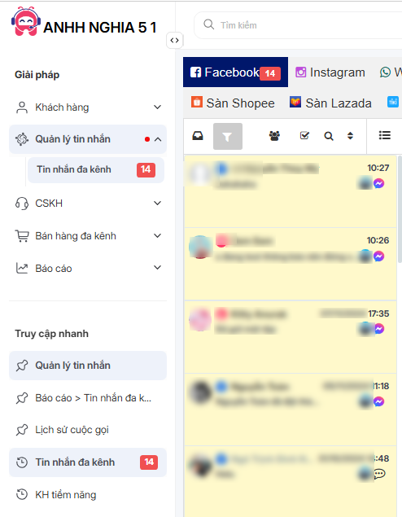{width="3.1145833333333335in"
height="4.854166666666667in"}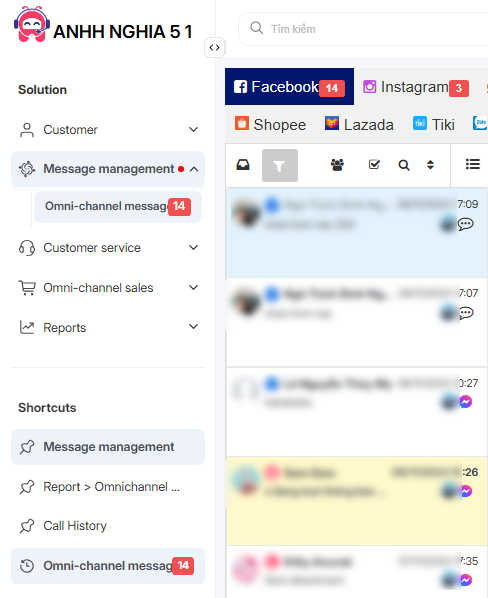{width="3.3333333333333335in"
height="4.854166666666667in"}

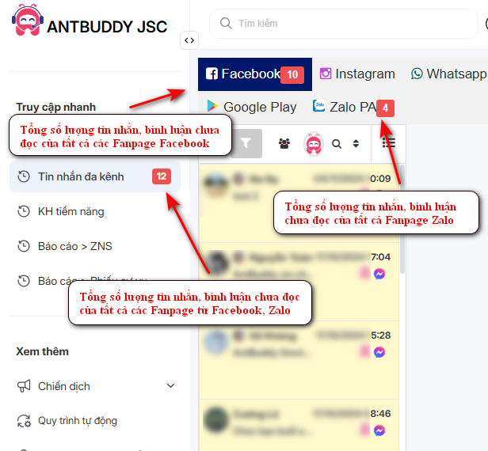{width="6.275950349956256in"
height="5.807292213473316in"}

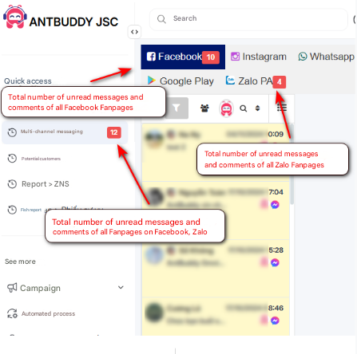{width="4.65625in" height="4.625in"}

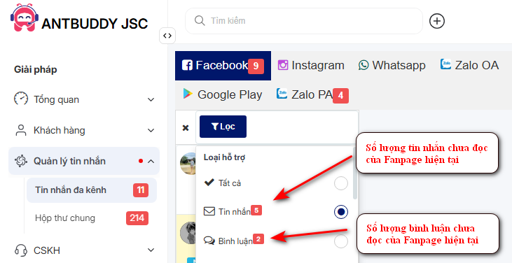{width="6.5in"
height="3.3472222222222223in"}

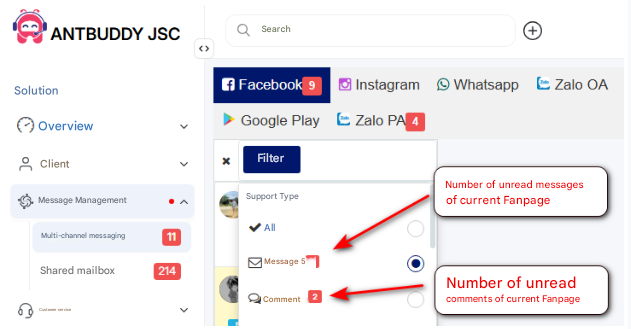{width="6.5in"
height="3.388888888888889in"}

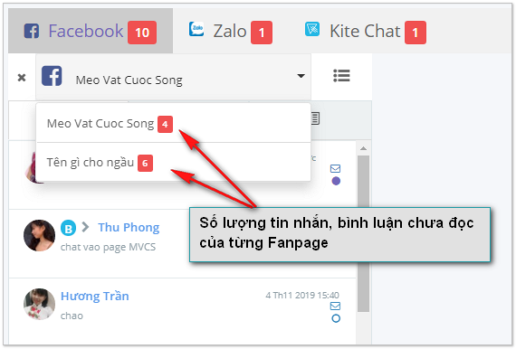{width="5.9375in"
height="4.020833333333333in"}

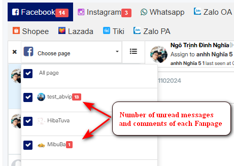{width="4.802083333333333in"
height="3.40625in"}

Để quản lý tin nhắn và hỗ trợ khách hàng nhanh nhất, nhân viên cần làm
các bước sau:

*(To manage messages and support customers as quickly as possible,
employees need to follow these steps:)*

Bước 1: Mở trang Omni

*(Step 1: Open the Omni page.)*

Bước 2: Click vào tab Facebook

*(Step 2: Click on the Facebook tab.)*

Bước 3: Click tab Inbox, bạn sẽ thấy tin nhắn vừa nhận từ khách hàng
Facebook

*(Step 3: Click the Inbox tab, and you will see the message received
from the Facebook customer.)*

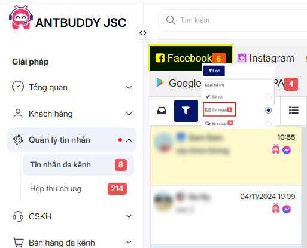{width="5.34375in"
height="4.322916666666667in"}

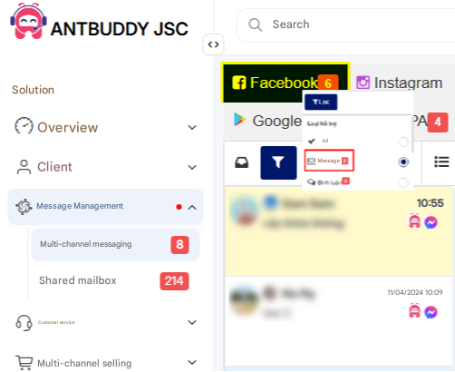{width="5.229166666666667in"
height="4.270833333333333in"}

Tại đây bạn có thể nhìn thấy người được phân công hỗ trợ bằng cách rê
chuột vào avatar nhỏ trên tin nhắn (xem hình).

*(Here, you can see the assigned support person by hovering over the
small avatar on the message (see image).)*

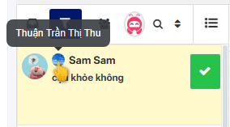{width="2.9583333333333335in"
height="1.6354166666666667in"}

Quyền xem các session được thiết lập ở mục Tương tác.

*(Permissions to view sessions are set in the Interaction section.)*

Bước 4: Click vào tin nhắn để chat hỗ trợ

*(Step 4: Click on the message to start chatting and provide support.)*

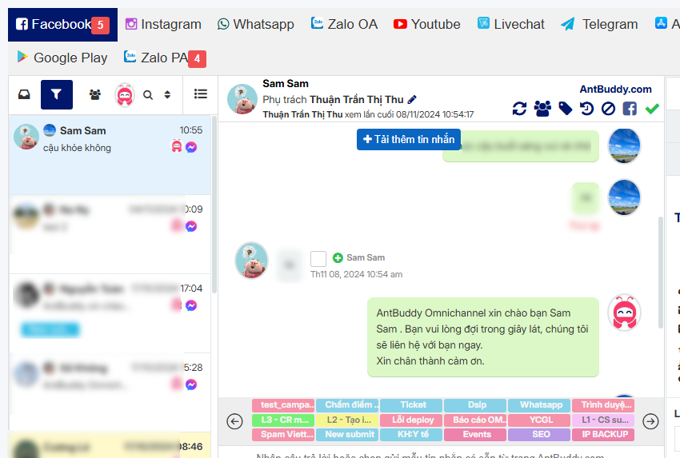{width="6.5in" height="4.375in"}

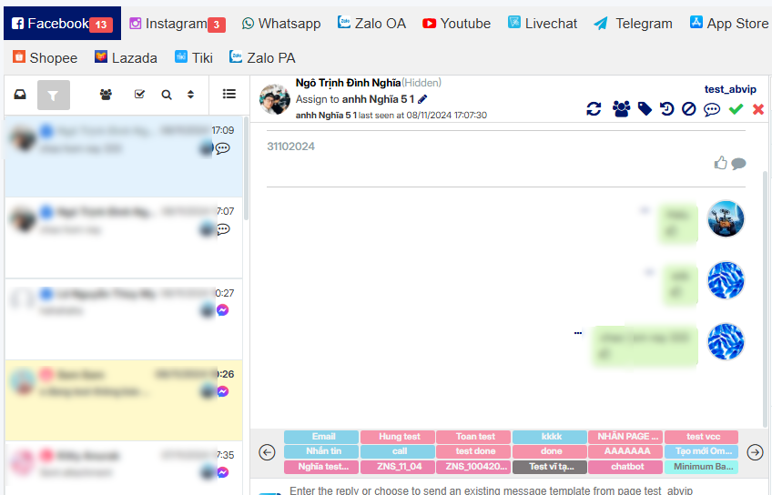{width="6.5in"
height="4.166666666666667in"}

## 3.1. Hướng dẫn gửi tin nhắn cho khách hàng {#hướng-dẫn-gửi-tin-nhắn-cho-khách-hàng .unnumbered}

##  *(Guide to Sending Messages to Customers)* {#guide-to-sending-messages-to-customers .unnumbered}

Bước 1: Nhập nội dung tin nhắn vào ô chatbox

*(Step 1: Enter the message content into the chatbox.)*

Bước 2: Nhấn Enter để gửi tin

*(Step 2: Press Enter to send the message.)*

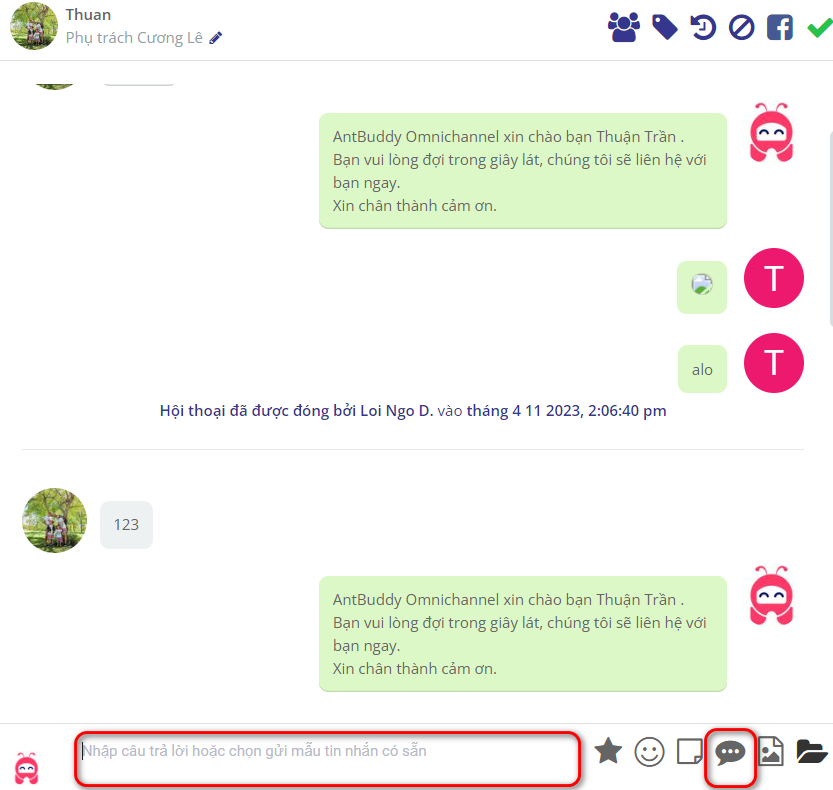{width="6.5in"
height="6.166666666666667in"}

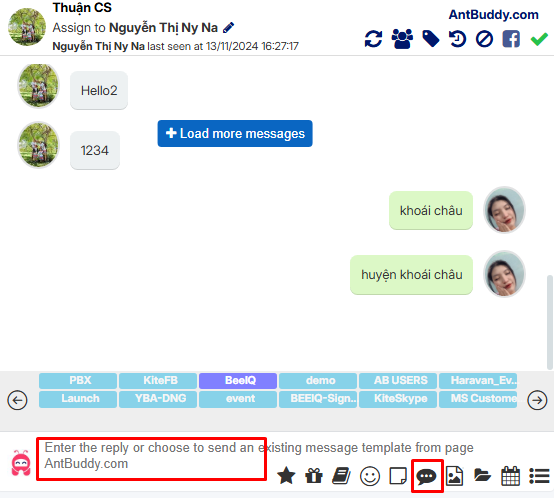{width="5.036458880139983in"
height="4.5273578302712165in"}

Hoặc chọn Danh sách mẫu tin nhắn- chọn từ mẫu tin nhắn và nhấn enter để
gửi

*(Or select from the Message Template List - choose a template and press
Enter to send.)*

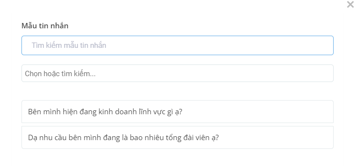{width="6.5in" height="3.0in"}

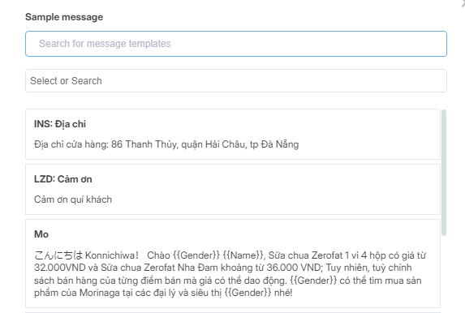{width="5.96875in"
height="4.020833333333333in"}

## 3.2. Hướng dẫn Xem lịch sử hội thoại {#hướng-dẫn-xem-lịch-sử-hội-thoại .unnumbered}

## *(Guide to Viewing Conversation History)* {#guide-to-viewing-conversation-history .unnumbered}

Bước 1: Mở một session chat: nhắn tin/ bình luận

*(Step 1: Open a chat session: send a message/comment.)*

Bước 2: Click vào icon
{width="0.3020833333333333in"
height="0.3645833333333333in"}Lịch sử hội thoại

*(Step 2: Click on the Conversation History*
{width="0.3020833333333333in"
height="0.3645833333333333in"} *icon.)*

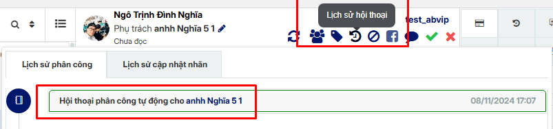{width="6.5in"
height="1.5277777777777777in"}

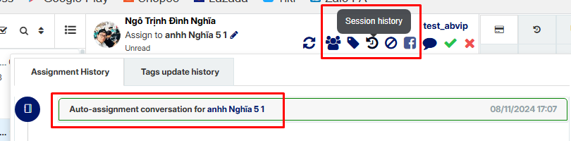{width="6.5in"
height="1.6111111111111112in"}

Lịch sử phân công:

*(Assignment History:)*

-   Gồm Loại phân công: tự động/thủ công

> *(Includes Assignment Type: automatic/manual.)*

-   Nhân viên phân công, Nhân viên được phân công

> *(Assigned Employee, Employee Assigned.)*

-   Thời gian phân công

> *(Assignment Time.)*

Lịch sử cập nhật nhãn: Tên nhân viên cập nhật, thời gian cập nhật, Tên
Nhãn...

*(Label Update History: Employee name who updated, update time, Label
name...)*

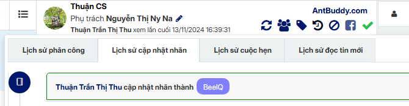{width="6.5in"
height="1.6944444444444444in"}

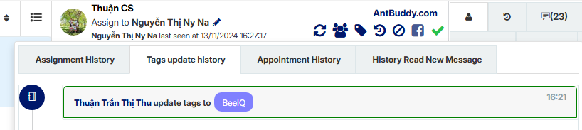{width="6.5in"
height="1.4583333333333333in"}

# 4. Hướng dẫn quản lý comment Facebook {#hướng-dẫn-quản-lý-comment-facebook .unnumbered}

# *(Guide to Managing Facebook Comments)* {#guide-to-managing-facebook-comments .unnumbered}

Khi có một khách hàng bình luận ở 1 bài viết trên trang, bình luận đó sẽ
được đưa về Omni - Facebook

*(When a customer comments on a post on the page, the comment will be
directed to Omni - Facebook.)*

Để quản lý bình luận và hỗ trợ khách hàng nhanh nhất, nhân viên cần làm
các bước sau:

*(To manage comments and support customers as quickly as possible,
employees need to follow these steps:)*

Bước 1: Mở trang Hội thoại đa kênh

*(Step 1: Open the Multi-Channel Conversations page.)*

Bước 2: Click vào tab Facebook

*(Step 2: Click on the Facebook tab.)*

Bước 3: Click tab Comment, bạn sẽ thấy các bình luận vừa nhận từ khách
hàng Facebook

*(Step 3: Click the Comment tab, and you will see the comments received
from Facebook customers.)*

{width="3.34375in"
height="3.3333333333333335in"}

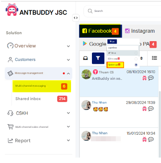{width="3.375in"
height="3.4270833333333335in"}

Tại đây bạn có thể nhìn thấy người được phân công hỗ trợ bằng cách rê
chuột vào avatar nhỏ trên bình luận (xem hình).

*(Here, you can see the assigned support person by hovering over the
small avatar on the comment (see image).)*

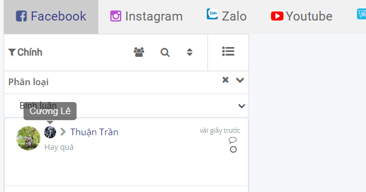{width="6.322916666666667in"
height="3.3125in"}

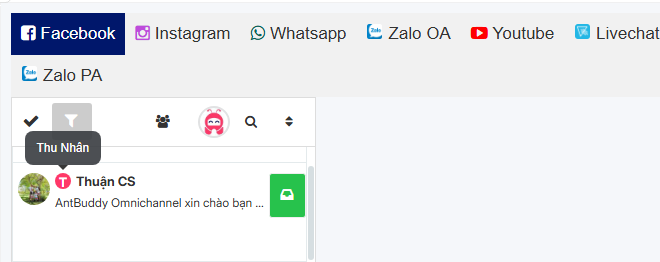{width="6.5in"
height="2.5833333333333335in"}

Đối với Owner và những admin có trong đội hỗ trợ, có thể nhìn thấy hết
tất cả các bình luận

*(For the Owner and admins in the support team, they can view all
comments.)*

Đối với nhân viên có trong đội hỗ trợ, chỉ có thể nhìn thấy các bình
luận chưa được phân công và những bình luận được phân công cho chính
nhân viên đó.

*(For employees in the support team, they can only see comments that
have not been assigned yet and comments that have been assigned to
them.)*

Hoặc nhân viên cũng có thể nhìn thấy các bình luận phân công cho các
nhân viên khác nếu được cấp quyền Tương tác ở mục 2.3

*(Alternatively, employees can also see comments assigned to other
employees if they are granted Interaction permissions in section 2.3.)*

Bước 4: Click vào bình luận để bình luận hỗ trợ

*(Step 4: Click on the comment to comment for support.)*

## 4.1. Hướng dẫn bình luận hỗ trợ khách hàng {#hướng-dẫn-bình-luận-hỗ-trợ-khách-hàng .unnumbered}

##  *(Customer Support Commenting Guide)* {#customer-support-commenting-guide .unnumbered}

Bước 1: Nhập nội dung bình luận

*(Step 1: Enter the comment content.)*

Bước 2: Nhấn Enter để gửi bình luận

*(Step 2: Press Enter to submit the comment.)*

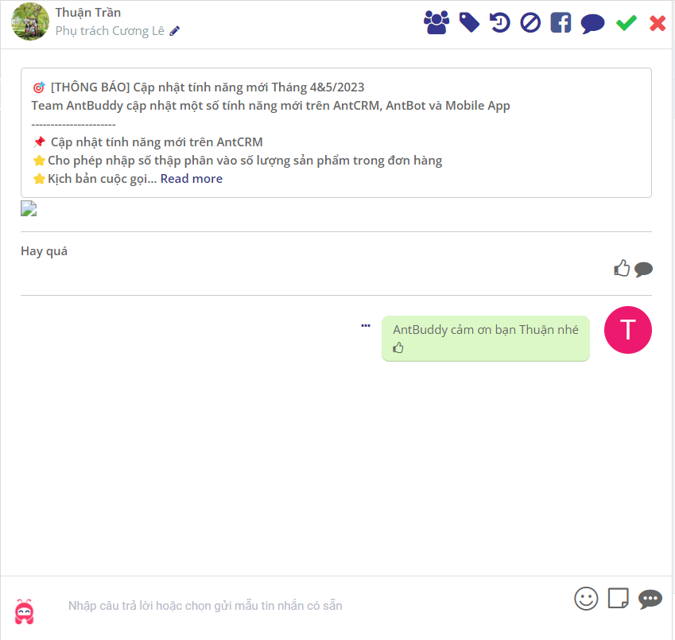{width="4.786458880139983in"
height="4.540998468941383in"}

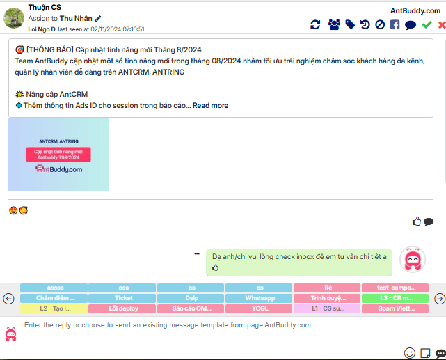{width="5.317708880139983in"
height="4.798161636045494in"}

## 4.2. Hướng dẫn ẩn bình luận {#hướng-dẫn-ẩn-bình-luận .unnumbered}

##  *(Guide to Hiding Comments)* {#guide-to-hiding-comments .unnumbered}

Có thể ẩn bình luận của nhân viên hoặc ẩn bình luận của khách hàng

Để ẩn bình luận của khách hàng bấm vào icon

*(You can hide comments from employees or hide comments from customers.*

*To hide a customer\'s comment, click on the icon.)*

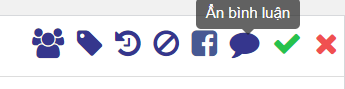{width="3.59375in"
height="0.9270833333333334in"}

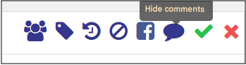{width="3.6354166666666665in"
height="0.96875in"}

Đối với các bình luận của nhân viên gửi ra thì ở đầu mỗi bình luận của
nhân viên có nút tùy chọn "**\...**", click vào

⇒Click Ẩn Bình luận

*(For comments made by employees, there is an options button "\..." at
the beginning of each employee's comment. Click on it*

*⇒ Click Hide Comment.)*

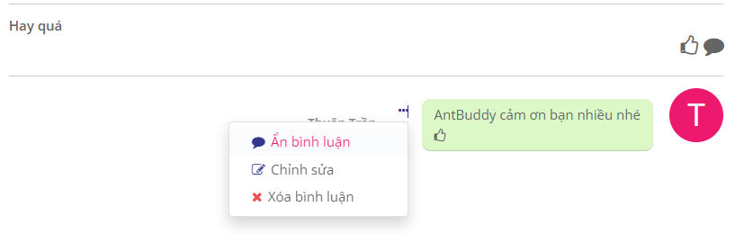{width="6.5in"
height="2.0694444444444446in"}

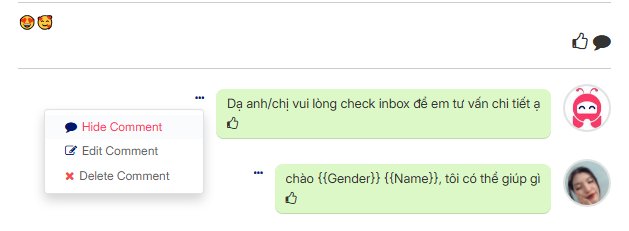{width="6.5in"
height="2.388888888888889in"}

## 4.3. Hướng dẫn chỉnh sửa bình luận {#hướng-dẫn-chỉnh-sửa-bình-luận .unnumbered}

## *(Guide to Editing Comments)* {#guide-to-editing-comments .unnumbered}

Bước 1: ở đầu mỗi bình luận có nút tùy chọn "**\...**", click vào

*(Step 1: At the beginning of each comment, there is an options button
"\...", click on it.)*

Bước 2: Click Chỉnh sửa

*(Step 2: Click Edit)*

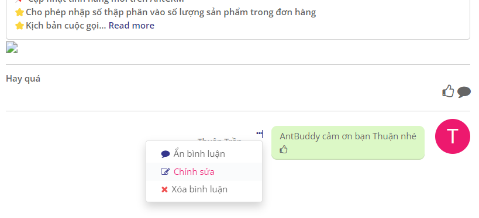{width="6.5in"
height="2.9722222222222223in"}

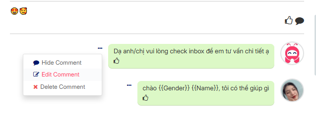{width="6.5in"
height="2.3333333333333335in"}

Bước 3: chỉnh sửa nội dung bình luận của bạn trên popup chỉnh sửa

*(Step 3: Edit the content of your comment in the edit popup.)*

{width="6.5in"
height="4.027777777777778in"}

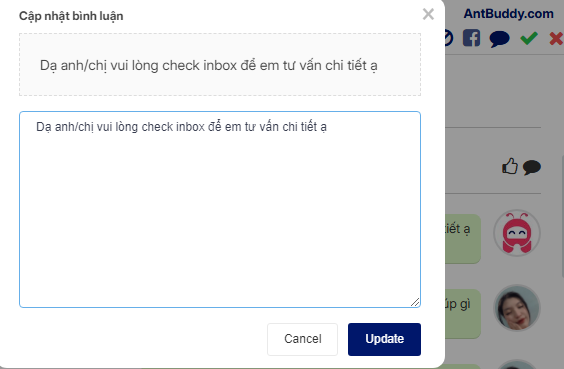{width="5.875in" height="3.84375in"}

Bước 4: Click **Cập Nhật**

*(Step 4: Click Update)*

**Lưu ý: Chỉ chỉnh sửa được bình luận của chính mình.**

*(Note: You can only edit your own comments.)*

## 4.4. Hướng dẫn xóa bình luận {#hướng-dẫn-xóa-bình-luận .unnumbered}

## *(Guide to Deleting Comments)* {#guide-to-deleting-comments .unnumbered}

##  {#section-1 .unnumbered}

Bước 1: ở đầu mỗi bình luận có nút tùy chọn "**\...**", click vào

*(Step 1: At the beginning of each comment, there is an options button
"\...", click on it.)*

Bước 2: Click **Xóa bình luận**

*(Step 2: Click delete comment)*

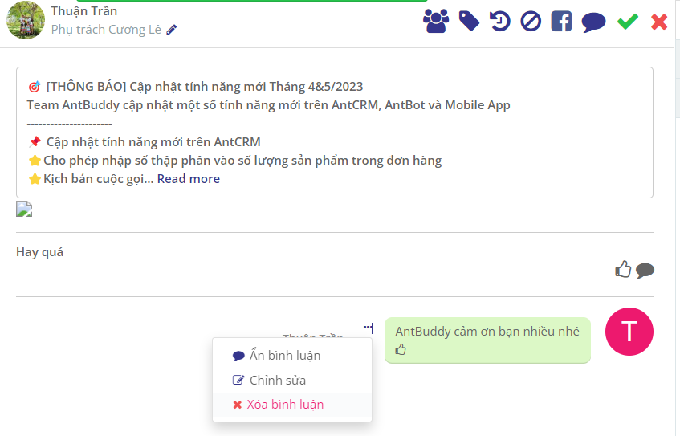{width="6.5in"
height="4.166666666666667in"}

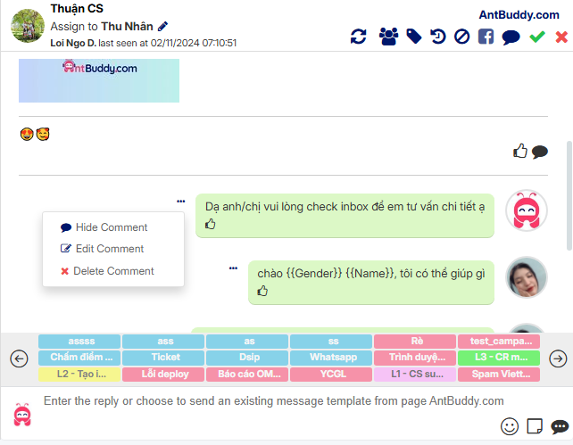{width="6.5in"
height="5.055555555555555in"}

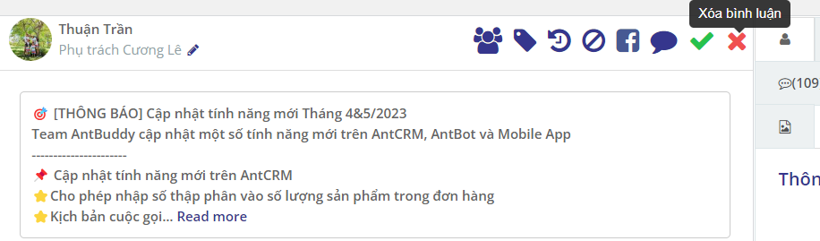{width="6.5in"
height="1.9027777777777777in"}

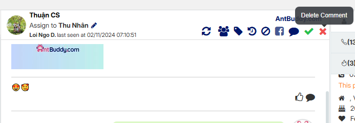{width="6.5in" height="2.25in"}

Bước 3: Click **Đồng ý** trên popup xác nhận xóa

*(Step 3: Click \'Agree\' on the confirmation popup to delete.)*

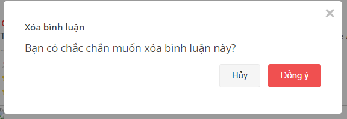{width="6.0in"
height="2.0729166666666665in"}

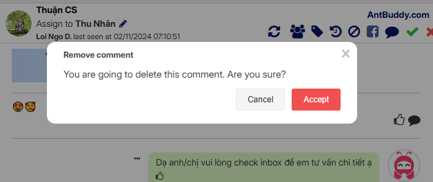{width="6.5in"
height="2.736111111111111in"}

## 4.5. Hướng dẫn Like/Unlike bình luận {#hướng-dẫn-likeunlike-bình-luận .unnumbered}

## *(Guide to Liking/Unliking Comments)* {#guide-to-likingunliking-comments .unnumbered}

Bước 1. Trên mỗi bình luận có icon like

*(Step 1. Each comment has a like icon.)*

Bước 2: Click để like bình luận (Click lần nữa để unlike)

*(Step 2: Click to like the comment (Click again to unlike).)*

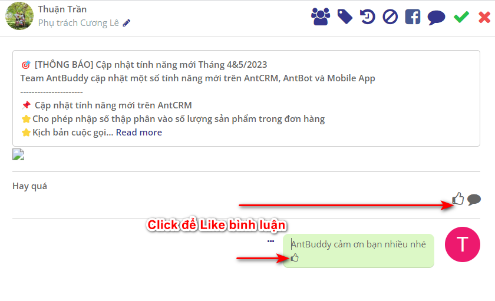{width="6.5in"
height="3.9583333333333335in"}

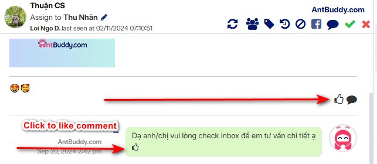{width="6.5in"
height="2.8333333333333335in"}

#  {#section-2 .unnumbered}

# 5. Hướng dẫn quản lý bài Post của trang {#hướng-dẫn-quản-lý-bài-post-của-trang .unnumbered}

# *(Guide to Managing Page Posts)* {#guide-to-managing-page-posts .unnumbered}

Bước 1: Mở trang Omni

*(Step 1: Open Omni page)*

Bước 2: Click vào tab Facebook

*(Step 2: Click on Facebook tab)*

Bước 3: Click tab Post, bạn sẽ thấy các bài post trên trang

*(Step 3: Click on tab post, you will see all the post in page)*

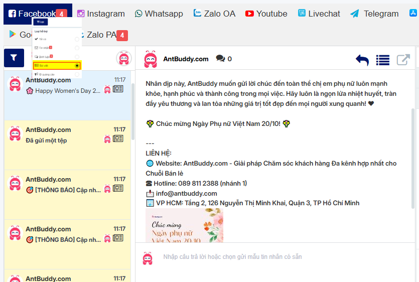{width="6.5in" height="4.375in"}

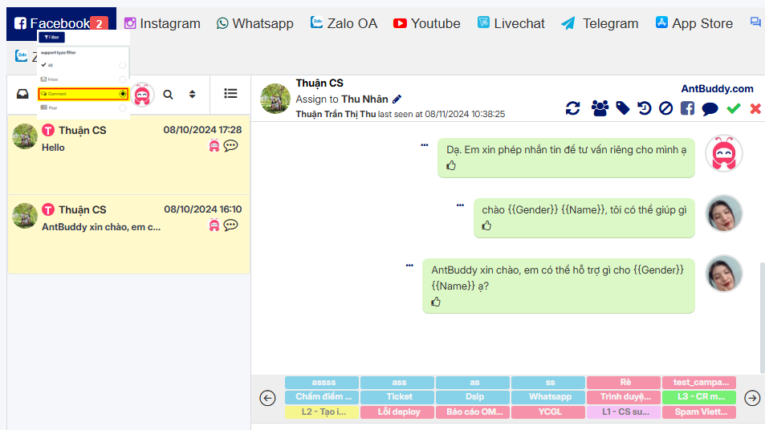{width="6.5in"
height="3.6527777777777777in"}

5.1. Hướng dẫn Xem thêm bình luận

## *(Guide to see more comments)* {#guide-to-see-more-comments .unnumbered}

Bước 1: Tại tab Post, click 1 bài post để xem chi tiết

*(Step 1: At tab post, click a post to see the detail)*

Bước 2: click Xem thêm câu trả lời

*(Step 2: Click to see more answers)*

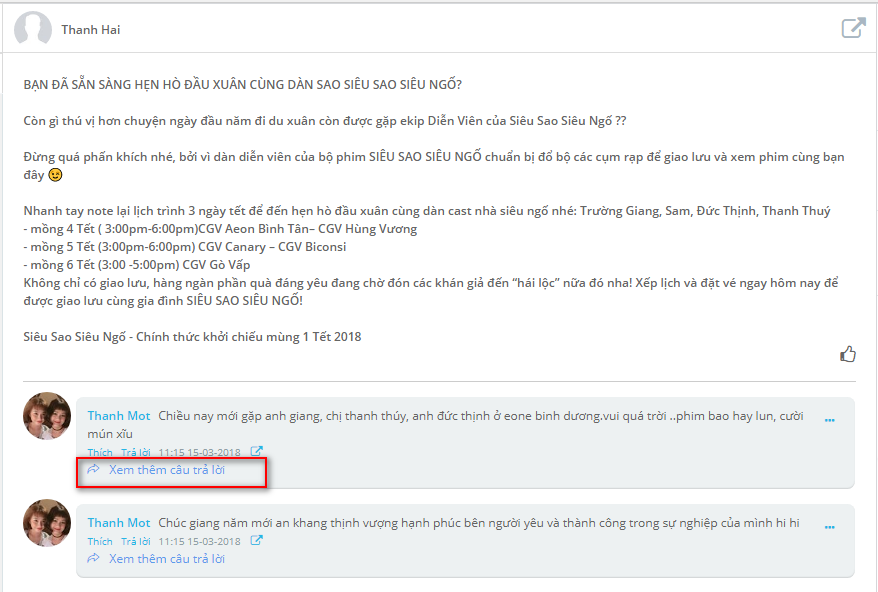{width="6.5in"
height="4.388888888888889in"}

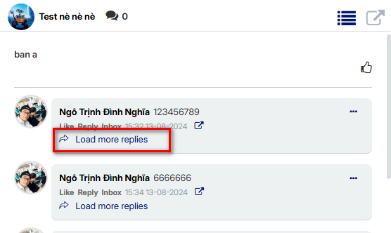{width="5.791666666666667in"
height="3.4583333333333335in"}

## 5.2. Hướng dẫn trả lời bình luận {#hướng-dẫn-trả-lời-bình-luận .unnumbered}

## *(Guide to answer the comment)* {#guide-to-answer-the-comment .unnumbered}

Bước 1: Tại tab Post, click 1 bài post để xem chi tiết

*(Step 1: At tab post, click a post to see the detail)*

Bước 2: click **Trả lời** ở dưới bình luận

*(Step 2: Click answer in the below comment)*

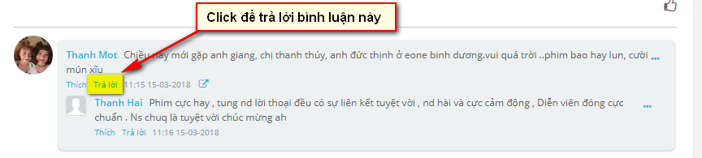{width="6.5in"
height="1.4722222222222223in"}

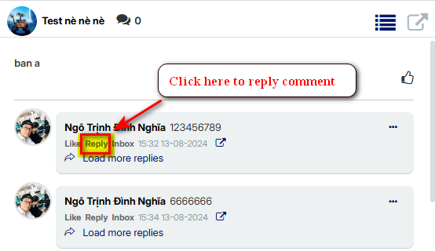{width="5.770833333333333in"
height="3.3333333333333335in"}

Bước 3: Lúc này sẽ hiện ra 1 thanh nhập nội dung trả lời ở dưới bình
luận đó, nhập nội dung trả lời

*(Step 3: At this point, a text input bar will appear below the comment.
Enter your reply in the text field.)*

Bước 4. Nhấn Enter để gửi trả lời bình luận

*(Step 4: Press Enter to submit the reply to the comment.)*

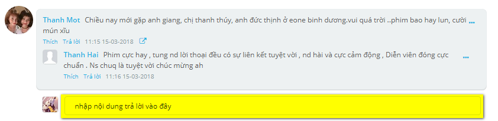{width="6.5in"
height="1.5833333333333333in"}

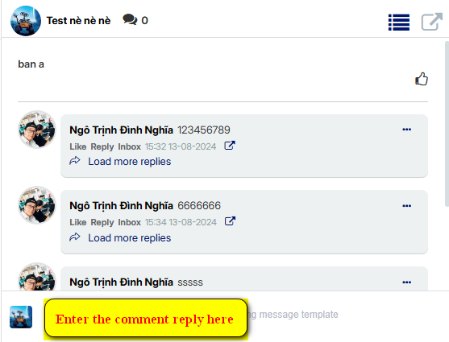{width="5.802083333333333in"
height="4.427083333333333in"}

Bạn có thể trả lời bình luận bằng mẫu tin nhắn Omni, các thao tác làm
giống như phần II. [[4.2. Hướng dẫn gửi bình luận dùng mẫu tin nhắn
Omni]{.underline}](https://docs.google.com/document/d/1aKL6SXUiwzJGkLm_N6T7bUjq-oOiuVJBSD8qh4qLXA0/edit#heading=h.5yzvwr7wokfb)

*(You can reply to the comment using an Omni message template. The steps
are the same as in [[Section II.4.2, \'Guide to Sending Comments Using
Omni Message
Templates.]{.underline}](https://docs.google.com/document/d/1aKL6SXUiwzJGkLm_N6T7bUjq-oOiuVJBSD8qh4qLXA0/edit#heading=h.5yzvwr7wokfb))*

## 5.3. Hướng dẫn xem bài viết,bình luận trên facebook {#hướng-dẫn-xem-bài-viếtbình-luận-trên-facebook .unnumbered}

## *(Guide to Viewing Posts and Comments on Facebook)* {#guide-to-viewing-posts-and-comments-on-facebook .unnumbered}

Bước 1: Mở trang Omni

*(Step 1: Open Omni page)*

Bước 2: Click vào tab Facebook

*(Step 2: Click on tab facebook)*

Bước 3: Click tab Post

*(Step 3: Click tab post)*

Bước 4: click 1 bài post để xem chi tiết

*(Step 4: Click a post to see the detail)*

Bước 5: click icon Xem bài viết (như hình)

*(Step 5: Click the \'View Post\' icon (as shown in the image))*

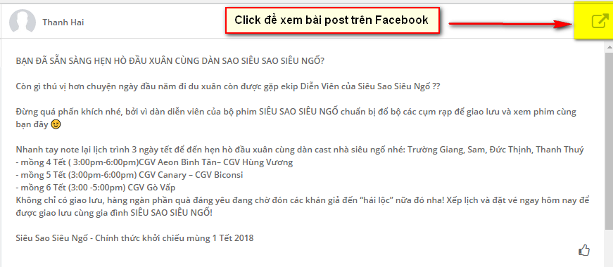{width="6.5in"
height="2.8333333333333335in"}

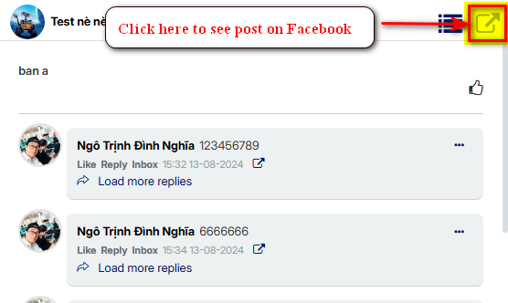{width="5.791666666666667in"
height="3.4583333333333335in"}

Để xem bình luận trên Facebook, click icon ở dưới mỗi bình luận (xem
hình)

*(To view comments on Facebook, click the icon below each comment (see
image))*

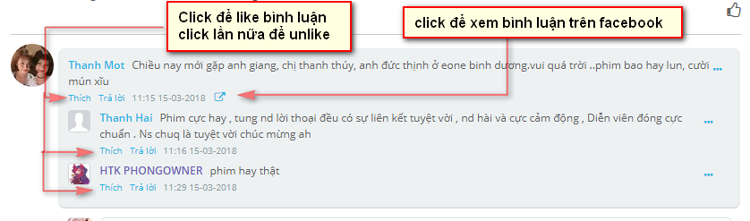{width="6.5in"
height="1.9166666666666667in"}

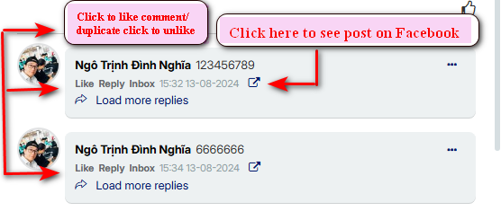{width="5.791666666666667in"
height="2.4479166666666665in"}

Để like bình luận, click **Thích** ở dưới bình luận (xem hình trên)

*(To like a comment, click Like below the comment (see image above))*

# 6. Hướng dẫn thay đổi người phụ trách session {#hướng-dẫn-thay-đổi-người-phụ-trách-session .unnumbered}

# *(Guide to Changing the Session Owner)* {#guide-to-changing-the-session-owner .unnumbered}

Bước 1. Vào xem 1 tin nhắn/comment bất kỳ

*(Step 1. View any message/comment.)*

Bước 2: Phía dưới tên của khách hàng có dòng "Phụ trách Cương Lê"

*(Step 2: Below the customer\'s name, there is a line that says \'In
charge: Cuong Le.)*

Bước 3: click vào nút chỉnh sửa bên cạnh để đổi người phân công

*(Step 3: Click the edit button next to it to change the assigned
person.)*

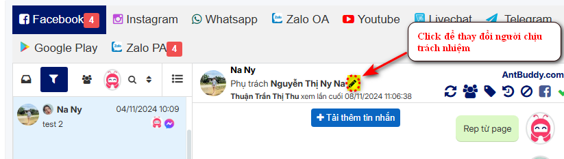{width="6.5in"
height="1.8333333333333333in"}

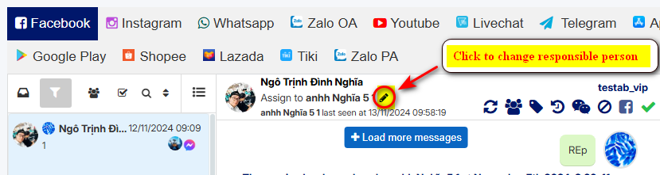{width="6.5in"
height="1.7361111111111112in"}

Chọn Nhóm và Người chịu trách nhiệm và click **Phụ trách**

**(Có thể Ghi chú thêm nội dung để NV phụ trách mới có thể nắm thêm
thông tin của session được phân công)**

*(Select the Group and Responsible Person, then click Assign.*

*(You can add a note with additional information to help the new
responsible person understand the details of the assigned session.))*

#  {#section-3 .unnumbered}

# 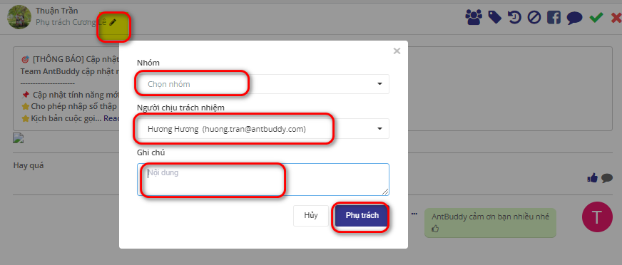{width="6.5in" height="2.7777777777777777in"} {#section-4 .unnumbered}

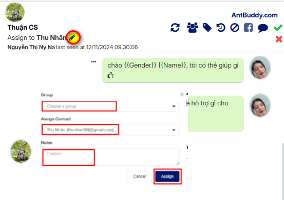{width="5.760416666666667in"
height="4.072916666666667in"}

Phía người được phân công phụ trách sẽ nhận được popup thông báo phân
công như hình:

*(The person assigned to the session will receive a popup notification
of the assignment, as shown in the image:)*

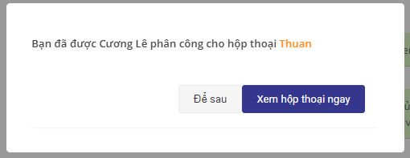{width="5.3125in"
height="2.0520833333333335in"}

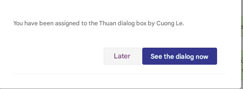{width="5.177083333333333in"
height="1.90625in"}

Click **Xem hội thoại ngay** để mở session được phân công, click **Để
sau** để ở lại phiên làm việc hiện tại

*(Click \'View Conversation Now\' to open the assigned session, or click
\'Later\' to stay in the current session.)*

# 7. Hướng dẫn thêm user hỗ trợ vào một session tin nhắn, bình luận: {#hướng-dẫn-thêm-user-hỗ-trợ-vào-một-session-tin-nhắn-bình-luận .unnumbered}

# *(Guide to Adding a Support User to a Message or Comment Session)*  {#guide-to-adding-a-support-user-to-a-message-or-comment-session .unnumbered}

Tính năng này được dùng khi user hiện tại cần sự giúp đỡ từ một nhân
viên khác để hỗ trợ khách hàng, chỉ cần mời nhân viên vào session, nhân
viên đó sẽ có thể phụ giúp cho nhân viên phụ trách chính của session.

*(This feature is used when the current user needs assistance from
another employee to support a customer. Simply invite the employee into
the session, and they will be able to assist the primary responsible
employee of the session.)*

Bước 1. Vào xem 1 tin nhắn/bình luận bất kỳ

*(Step 1: Open any message/comment.)*

Bước 2: Click vào icon thêm **Hỗ trợ**

*(Step 2: Click on the \'Add Support\' icon.)*

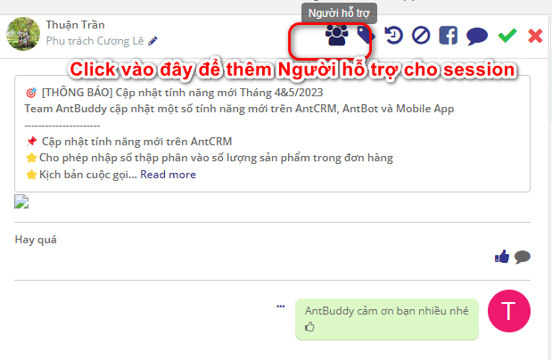{width="6.447916666666667in"
height="4.208333333333333in"}

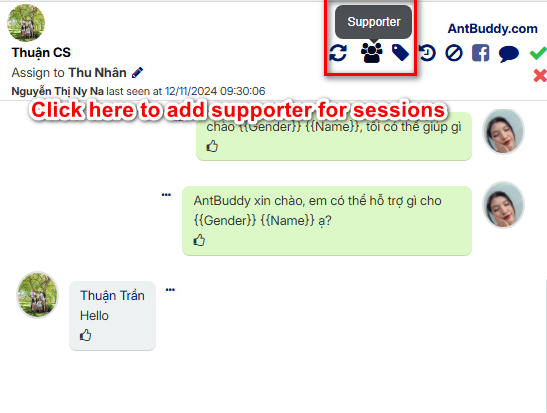{width="5.697916666666667in"
height="4.302083333333333in"}

Bước 3: Chọn hoặc tìm kiếm tên để thêm vào hỗ trợ

*(Step 3: Select or search for a name to add for support.)*

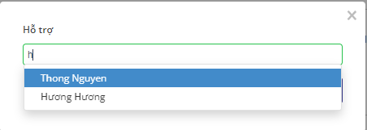{width="4.708333333333333in"
height="1.6770833333333333in"}

{width="4.572916666666667in"
height="1.3645833333333333in"}

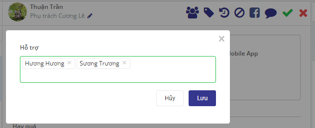{width="6.5in"
height="2.6527777777777777in"}

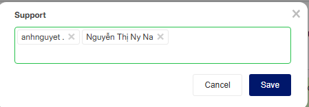{width="6.551042213473316in"
height="2.276042213473316in"}

Có thể thêm 1 hoặc nhiều nhân viên hỗ trợ

*(You can add one or multiple support staff.)*

Click **X** để xóa nhân viên hỗ trợ ra khỏi danh sách

*(Click **X** to remove the support staff from the list.)*

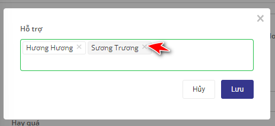{width="4.833333333333333in"
height="2.21875in"}

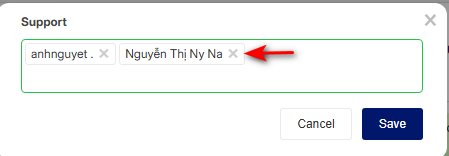{width="4.677083333333333in"
height="1.625in"}

Bước 4: Click Lưu

*(Step 4: Click Save)*

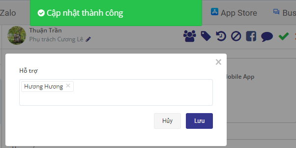{width="6.270833333333333in"
height="3.1354166666666665in"}

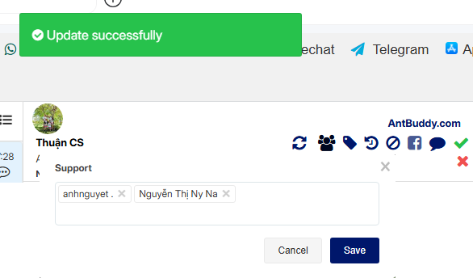{width="6.104166666666667in"
height="3.5833333333333335in"}

Tại màn hình nhân viên được thêm vào hỗ trợ sẽ hiện popup thông báo

*(On the screen, the added support staff will receive a popup
notification.)*

{width="5.645833333333333in"
height="2.3854166666666665in"}

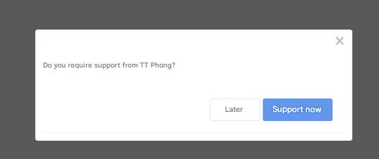{width="5.604166666666667in"
height="2.3541666666666665in"}

Click **Hỗ trợ ngay** để mở session cần hỗ trợ, click **Để sau** để ở
lại phiên làm việc hiện tại.

*(Click \'Support Now\' to open the session that needs support, or click
\'Later\' to stay in the current session.)*

Đối với các session là Hỗ trợ, nhân viên có thể nhận biết được bằng dòng
chữ **Hỗ trợ** ở ngay session đó

*(For support sessions, employees can identify them by the word
\'Support\' displayed in the session.)*

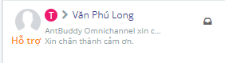{width="2.9375in"
height="0.8229166666666666in"}

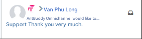{width="2.9479166666666665in"
height="0.8229166666666666in"}

# 8. Hướng dẫn gắn nhãn cho session {#hướng-dẫn-gắn-nhãn-cho-session .unnumbered}

# *(Guide to Tagging a Session)* {#guide-to-tagging-a-session .unnumbered}

Tính năng này cho phép gắn 1/nhiều nhãn cho 1 session chat để phân loại
các session theo Nhãn. Có 2 cách gắn nhãn cho session:

*(This feature allows you to tag one or multiple labels to a chat
session in order to categorize the sessions by labels. There are 2 ways
to tag labels for a session:)*

Cách 1: Bấm vào icon nhãn
{width="0.3333333333333333in"
height="0.2604166666666667in"}

*(Method 1: Click on label
icon*{width="0.3333333333333333in"
height="0.2604166666666667in"}*)*

Bước 1. Vào xem 1 tin nhắn/bình luận bất kỳ

*(Step 1: Open any message/comment.)*

Bước 2: Click vào icon Tags

*(Step 2: Click on icon tags)*

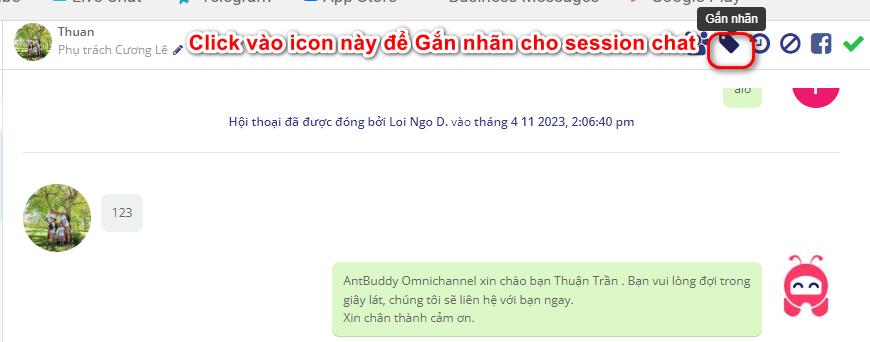{width="6.5in"
height="2.5555555555555554in"}

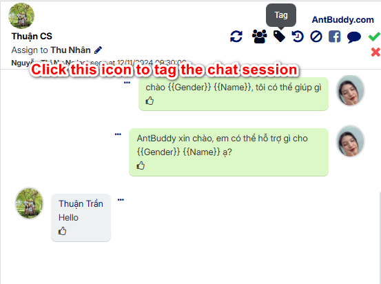{width="5.760416666666667in"
height="4.291666666666667in"}

Bước 3: Chọn các Nhãn từ danh sách có sẵn

*(Step 3: Select labels from the available list.)*

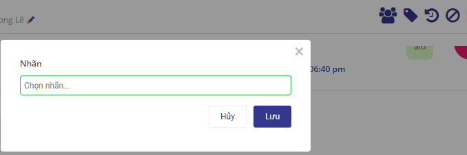{width="6.5in"
height="2.1666666666666665in"}

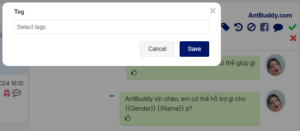{width="6.4375in" height="2.8125in"}

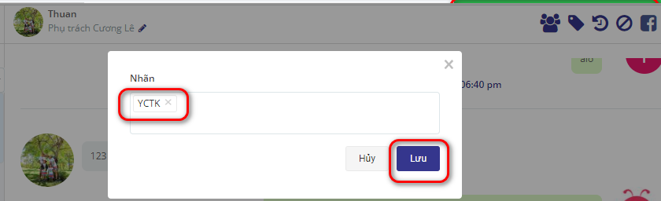{width="6.5in"
height="1.9861111111111112in"}

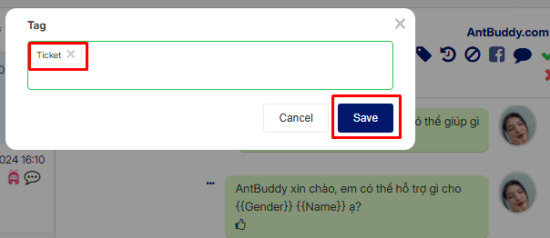{width="6.291666666666667in"
height="2.7291666666666665in"}

Cách 2: Chọn nhãn từ danh sách nhãn nằm trên ô chatbox

*(Method 2: Select a label from the list of labels on the chatbox)*

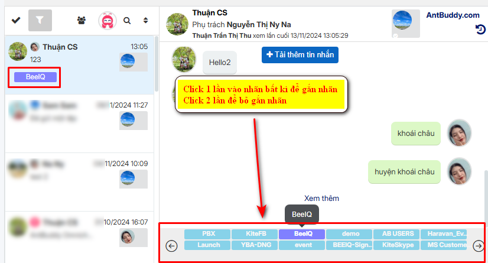{width="6.5in" height="3.5in"}

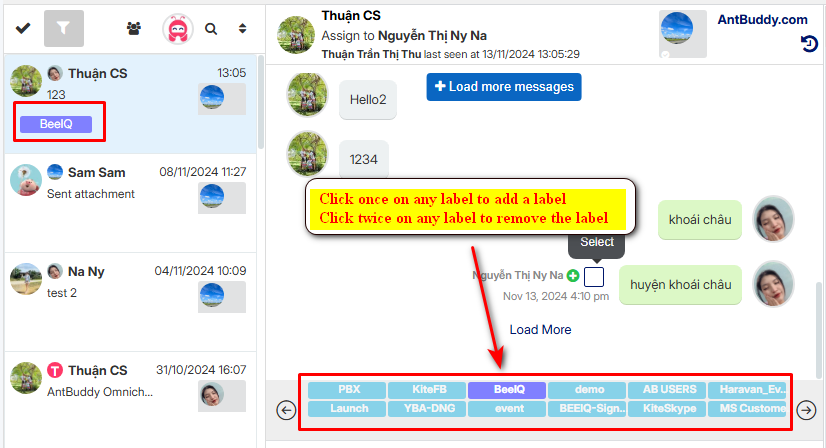{width="6.5in"
height="3.5277777777777777in"}

Nhãn sau khi được cập nhật thành công sẽ nằm ở danh sách các session -
ngay dưới tên session

*(Once the label is successfully updated, it will appear in the session
list, just below the session name.)*

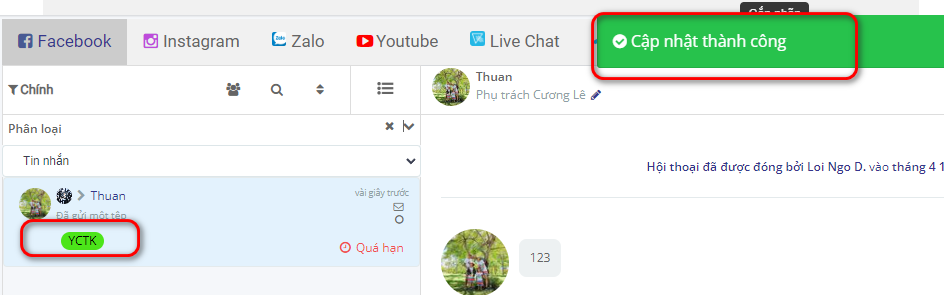{width="6.5in"
height="2.0277777777777777in"}

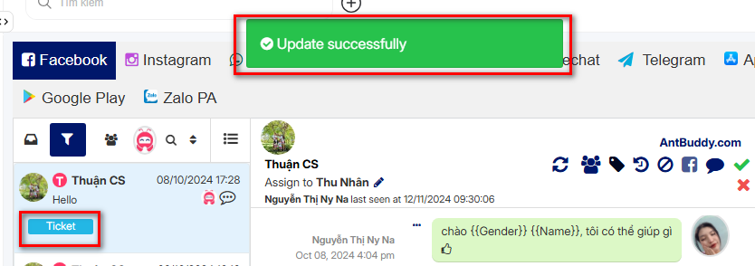{width="6.5in"
height="2.2916666666666665in"}

# 9. Hướng dẫn gửi hình ảnh {#hướng-dẫn-gửi-hình-ảnh .unnumbered}

# *(Guide to Sending Images)* {#guide-to-sending-images .unnumbered}

Bước 1. Tại thanh chat, click icon
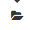{width="0.2968755468066492in"
height="0.3206255468066492in"}

*(Step 1: In the chat bar, click the icon.)*

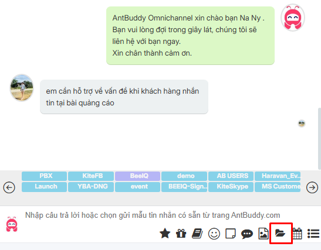{width="5.697916666666667in"
height="4.447916666666667in"}

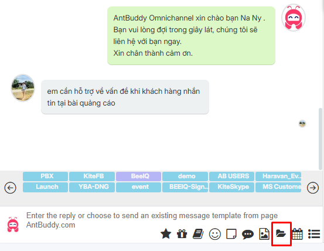{width="5.083333333333333in"
height="3.934297900262467in"}

Bước 2. Chọn hình ảnh cần gửi

*(Step 2: Choose the picture to send)*

Bước 3. Click Open

*(Step 3: Click open)*

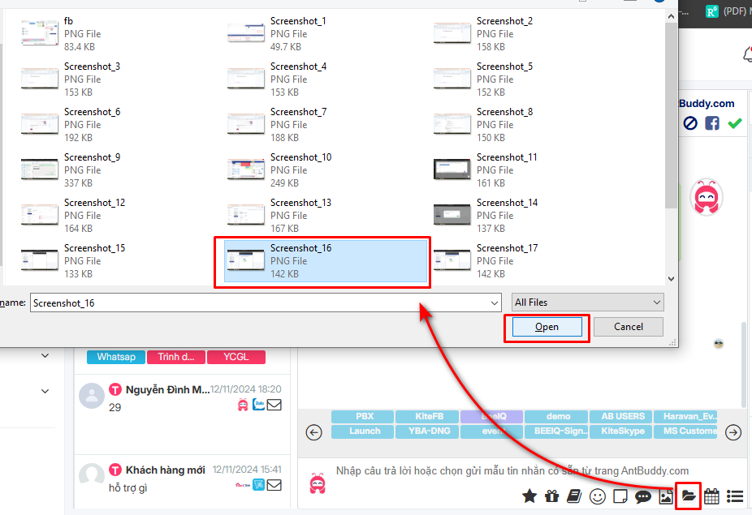{width="6.5in"
height="4.458333333333333in"}

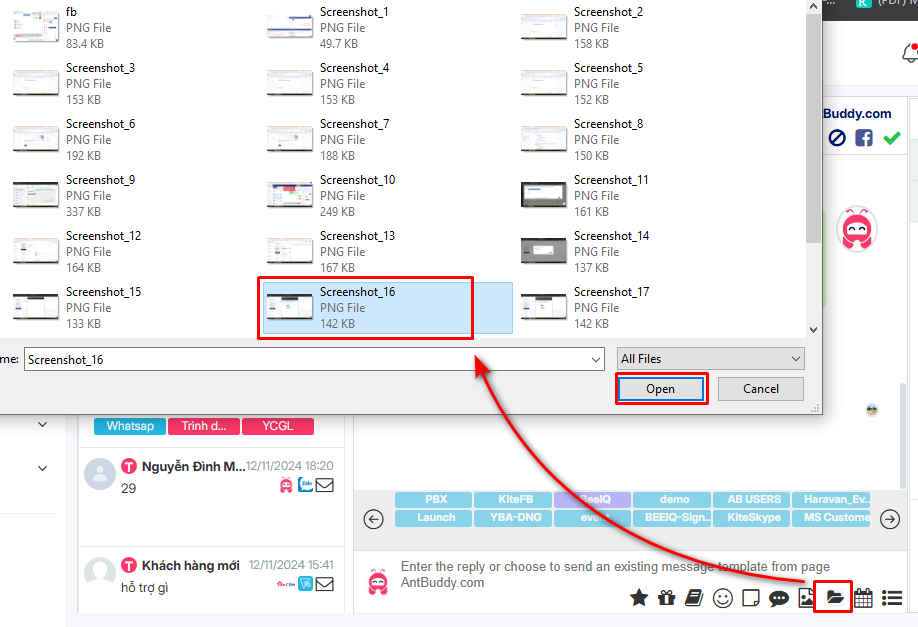{width="6.5in"
height="4.444444444444445in"}

Hình ảnh sẽ được gửi đi

*(The image will be sent.)*

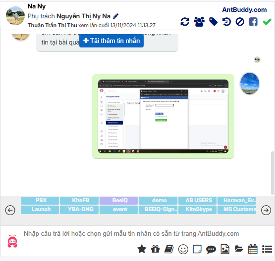{width="5.78125in" height="5.5in"}

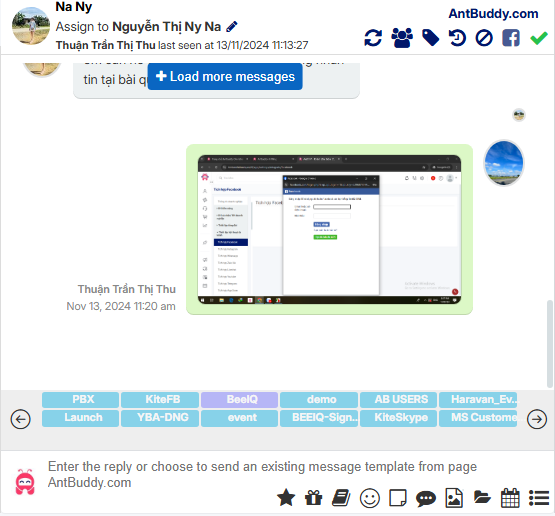{width="5.78125in" height="5.375in"}

Đây là ảnh nhận được từ khách hàng

*(This is the image received from the customer.)*

Để xem toàn bộ ảnh, click vào ảnh

*(To view the full image, click on the image.)*

# 10. Hướng dẫn Đánh dấu Xong cho session {#hướng-dẫn-đánh-dấu-xong-cho-session .unnumbered}

# *(Guide to Marking a Session as Done)* {#guide-to-marking-a-session-as-done .unnumbered}

Tính năng này dùng để đóng và chuyển các session đã được hỗ trợ vào bộ
lọc Xong.

Qua đó ta thông kê được số lượng session đã được hỗ trợ, thời gian hỗ
trợ ...

*(This feature is used to close and move sessions that have been
supported into the \'Done\' filter.*

*This allows for tracking the number of sessions supported, support
time, and other statistics.)*

Bước 1: Mở vào session của 1 tin nhắn/ bình luận

*(Step 1: Open the session of a message/comment.)*

Bước 2: Hỗ trợ khách hàng: Trả lời tin nhắn, bình luận, đính kèm file ,
gắn nhãn,\...

*(Step 2: Assist the customer: Reply to messages, comments, attach
files, add labels, etc.)*

Bước 3: Click vào Icon
{width="0.4166666666666667in"
height="0.4479166666666667in"} Đánh dấu đã xong

*(Step 3: Click on the Mark as Done*
{width="0.4166666666666667in"
height="0.4479166666666667in"} *icon.)*

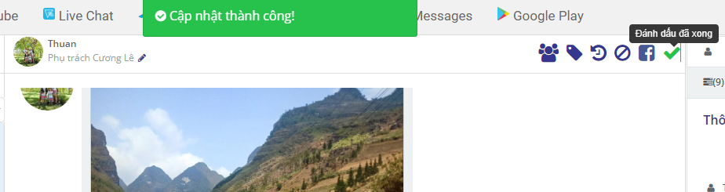{width="6.5in"
height="1.7222222222222223in"}

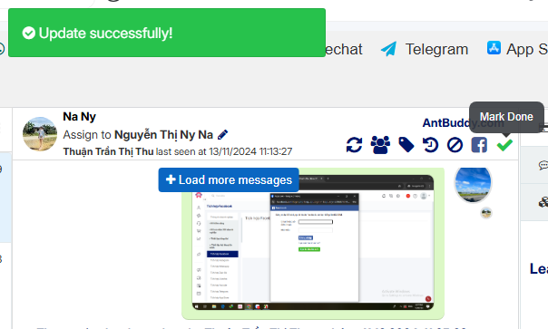{width="6.291666666666667in"
height="3.244792213473316in"}

Ta có thể tìm lại các tin nhắn đã đóng ở bộ lọc XONG. Sẽ có thông tin
đầy đủ về: Nhân viên đóng và thời gian đóng

*(You can find the closed messages in the DONE filter. It will show
complete information about the employee who closed it and the closure
time.)*

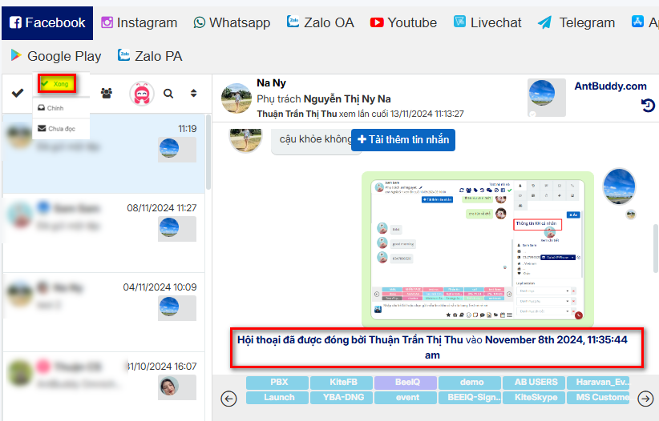{width="6.5in"
height="4.152777777777778in"}

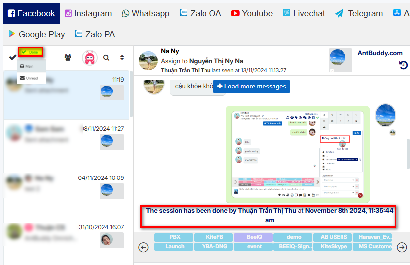{width="6.5in"
height="4.194444444444445in"}

Có thể chủ động Chuyển đến hộp thư- mở lại session chat này để tiếp tục
chat với khách hàng

*(You can proactively move to the inbox to reopen this chat session and
continue chatting with the customer.)*

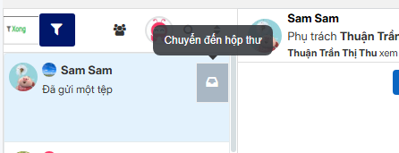{width="4.645833333333333in"
height="1.78125in"}

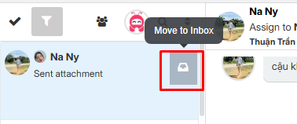{width="3.9375in"
height="1.6458333333333333in"}

Trường hợp nếu Khách hàng nhắn tin lại thì session cũng sẽ được mở lại
và chuyển tới bộ lọc Chính

*(If the customer sends a message again, the session will be reopened
and moved to the Main filter.)*

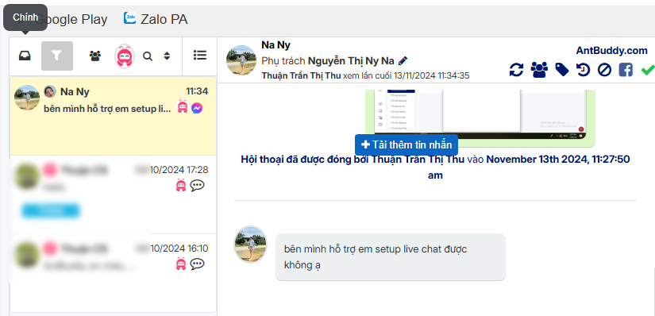{width="6.5in"
height="3.138888888888889in"}

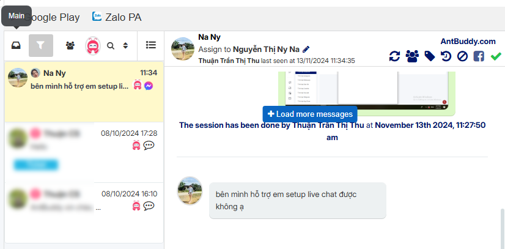{width="6.5in"
height="3.2083333333333335in"}

# 11. Làm thế nào để thêm mẫu tin nhắn Omni và sử dụng chúng? {#làm-thế-nào-để-thêm-mẫu-tin-nhắn-omni-và-sử-dụng-chúng .unnumbered}

# *(How to Add and Use Omni Message Templates?)* {#how-to-add-and-use-omni-message-templates .unnumbered}

## 11.1. Hướng dẫn thêm/ sửa/ xóa mẫu tin nhắn Omni {#hướng-dẫn-thêm-sửa-xóa-mẫu-tin-nhắn-omni .unnumbered}

## *(Guide to Add/Edit/Delete Omni Message Templates)* {#guide-to-addeditdelete-omni-message-templates .unnumbered}

Bước 1: Trên thanh menu trái, click **Thiết lập**

*(Step 1: On the left menu bar, click on Settings.)*

Bước 2: Click **Thiết lập hội thoại đa kênh**

*(Step 2: Click on Multi-channel Conversation Settings.)*

Bước 3: Mở phần **Mẫu tin nhắn Omni**

*(Step 3:Open the Omni Message Templates section.)*

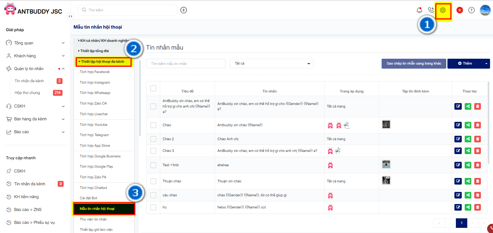{width="6.5in"
height="3.0833333333333335in"}

{width="6.5in"
height="2.9166666666666665in"}

Tại trang Mẫu tin nhắn Hội thoại, bạn có thể thêm, sửa hoặc xóa tin
nhắn. Dưới đây là hướng dẫn cụ thể

*(On the Conversation Message Templates page, you can add, edit, or
delete messages. Below is a detailed guide.)*

### 11.1.1. Hướng dẫn thêm mẫu tin nhắn {#hướng-dẫn-thêm-mẫu-tin-nhắn .unnumbered}

### *(Guide to Adding a Message Template)* {#guide-to-adding-a-message-template .unnumbered}

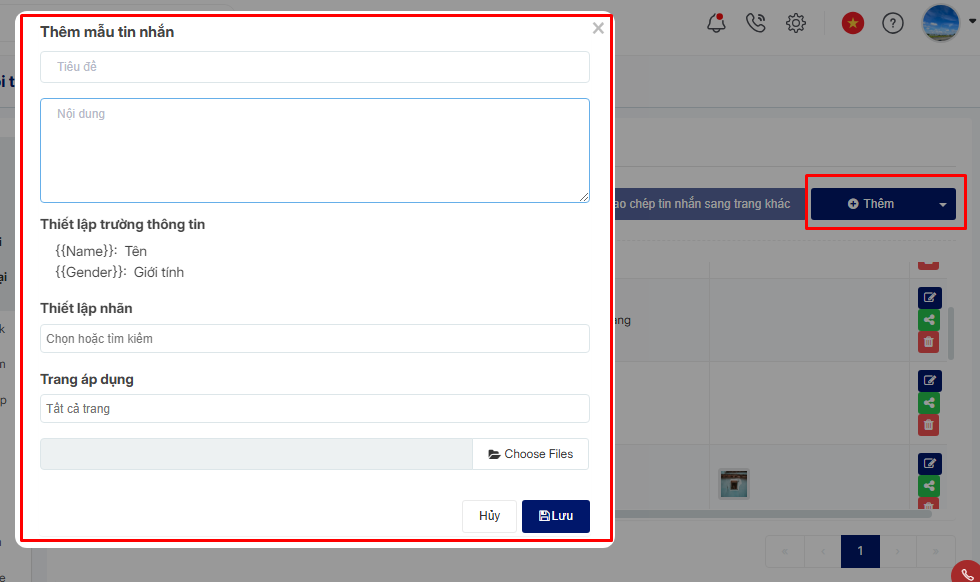{width="6.5in"
height="3.861111111111111in"}

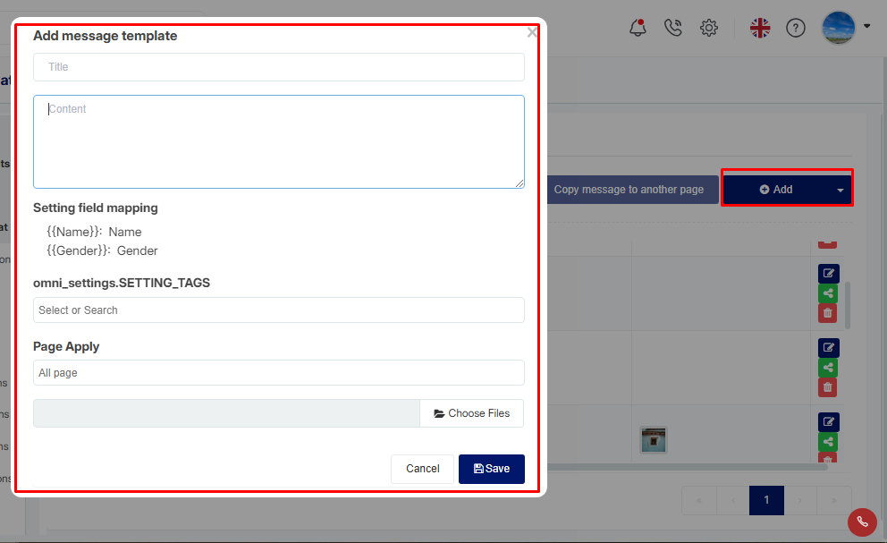{width="6.5in"
height="3.9722222222222223in"}

Bước 1: Nhập thông tin mẫu tin nhắn mới

*(Step 1: Enter information for the new message template.)*

-   Tiêu đề: Không bắt buộc

> (Title: Optional.)

-   Nội dung: phần tin nhắn sẽ hiển thị khi gửi cho khách hàng

> (Content: The message that will be displayed when sent to the
> customer.)

-   Nhãn: chọn hoặc tìm kiếm nhãn để thêm vào mẫu tin nhắn (không bắt
    buộc)

> *(Label: Select or search for a label to add to the message template
> (optional).)*

-   Trang: Chọn trang áp dụng mẫu tin nhắn: Mặc định sẽ áp dụng Tất cả
    trang

> *(Page: Select the page to apply the message template to: By default,
> it will apply to All Pages.)*

-   Chọn file đính kèm(không bắt buộc)

> *(Select an attachment (optional).)*

Bước 2: Nhấn **Lưu**

*(Step 2: Click Save.)*

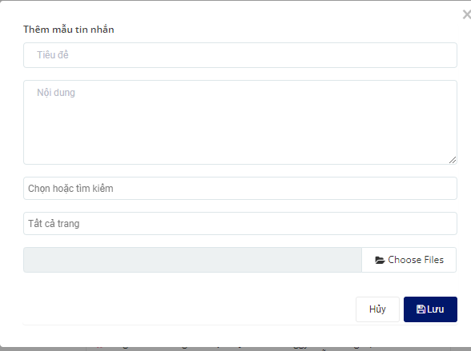{width="5.078125546806649in"
height="3.791321084864392in"}

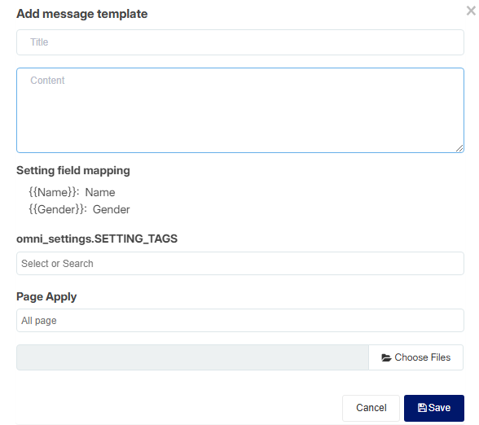{width="4.723958880139983in"
height="4.193838582677166in"}

### 11.1.2. Hướng dẫn chỉnh sửa mẫu tin nhắn {#hướng-dẫn-chỉnh-sửa-mẫu-tin-nhắn .unnumbered}

### *(Guide to Editing a Message Template)* {#guide-to-editing-a-message-template .unnumbered}

Bước 1: Click nút Edit ở mẫu tin nhắn cần sửa

*(Step 1: Click the Edit button on the message template you want to
edit.)*

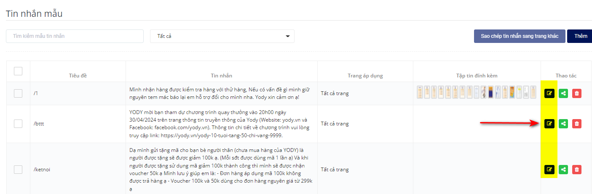{width="6.267716535433071in"
height="2.0555555555555554in"}

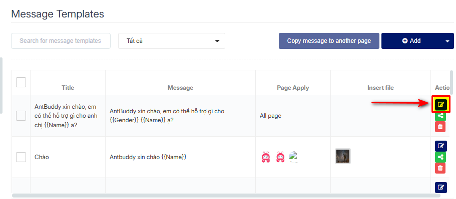{width="6.234375546806649in"
height="2.7275393700787403in"}

Bước 2: Chỉnh sửa nội dung hoặc các thành phần khác

*(Step 2: Edit the content or other components.)*

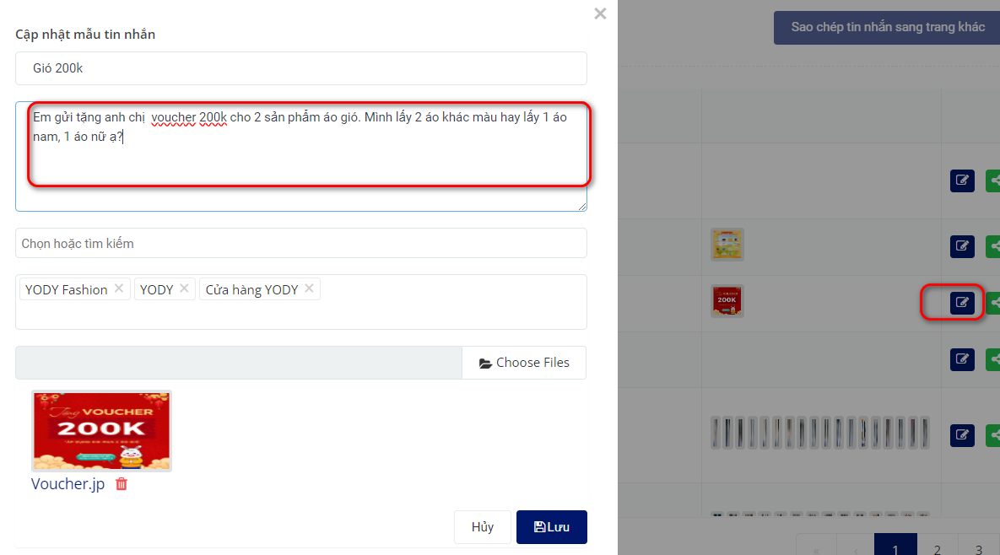{width="6.046875546806649in"
height="3.3624496937882764in"}

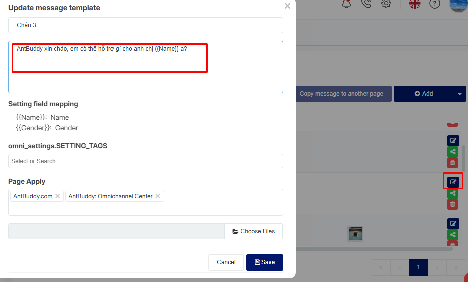{width="6.5in"
height="3.9305555555555554in"}

3: Click **Lưu**

*(Step 3: Click save)*

### 11.1.3. Hướng dẫn xóa mẫu tin nhắn {#hướng-dẫn-xóa-mẫu-tin-nhắn .unnumbered}

### *(Guide to Deleting a Message Template)* {#guide-to-deleting-a-message-template .unnumbered}

Bước 1: click nút xóa ở mẫu tin nhắn cần xóa

*(Step 1: Click the delete button on the message template you want to
delete.)*

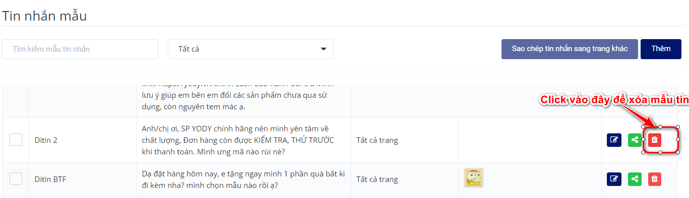{width="6.267716535433071in"
height="1.8055555555555556in"}

{width="6.5in"
height="2.7777777777777777in"}

Bước 2: click nút Xóa ở popup xác nhận

*(Step 2: Click the Delete button on the confirmation popup.)*

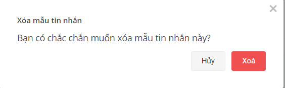{width="5.875in"
height="1.8229166666666667in"}

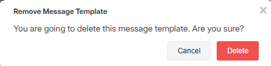{width="5.807292213473316in"
height="1.425663823272091in"}

## 11.2. Hướng dẫn sử dụng mẫu tin nhắn Omni {#hướng-dẫn-sử-dụng-mẫu-tin-nhắn-omni .unnumbered}

## *(Omni Message Template User Guide)* {#omni-message-template-user-guide .unnumbered}

Bước 1: tại thanh chat, Click vào biểu tượng
{width="0.4305555555555556in"
height="0.5416666666666666in"}, các mẫu tin nhắn sẽ hiện ra

*(**Step 1:** In the chat bar, click on the icon*
{width="0.4305555555555556in"
height="0.5416666666666666in"}*, and the message templates will
appear.)*

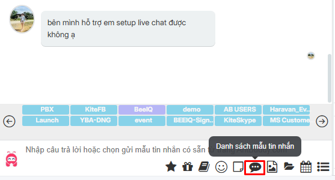{width="5.802083333333333in"
height="3.125in"}

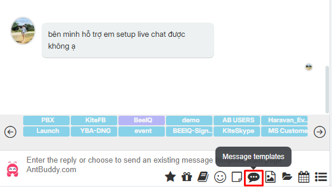{width="5.8125in" height="3.28125in"}

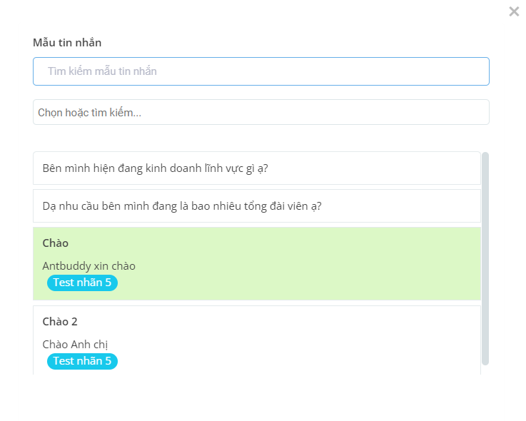{width="5.005208880139983in"
height="4.015807086614173in"}

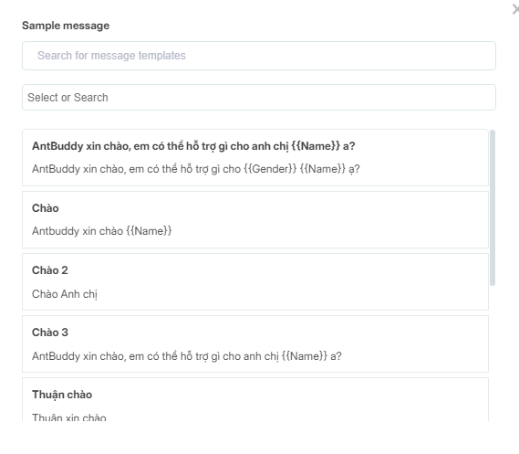{width="4.578125546806649in"
height="3.985103893263342in"}

Bước 2: click vào dòng mẫu tin nhắn cần dùng để chọn

*(Step 2: Click on the message template line you want to use to select
it.)*

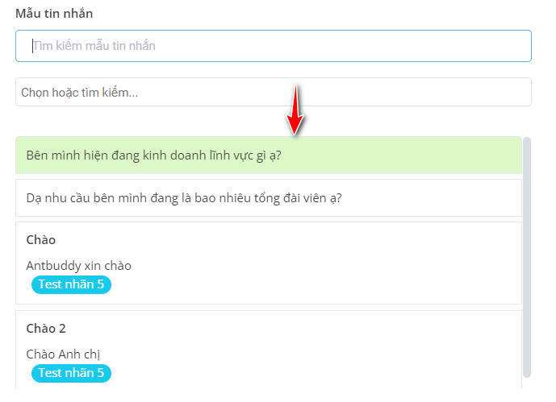{width="4.015625546806649in"
height="2.9038615485564305in"}

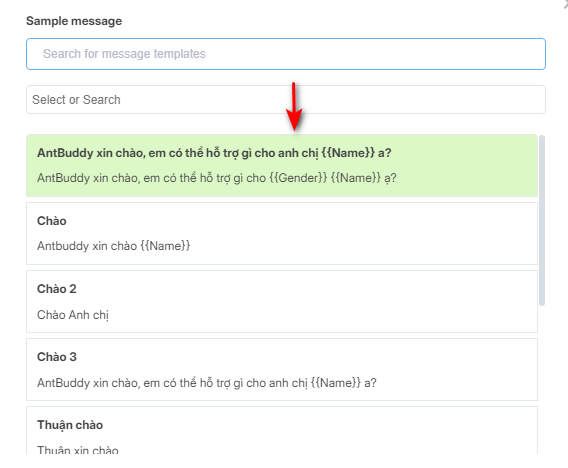{width="4.067708880139983in"
height="3.336434820647419in"}

Bước 3: Tin nhắn sau khi được chọn sẽ nằm ở khung chat, nhấn Enter để
gửi

*(Step 3: The selected message will appear in the chat box; press Enter
to send.)*

{width="6.267716535433071in"
height="1.3333333333333333in"}

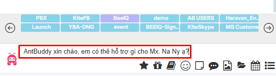{width="5.78125in" height="1.59375in"}

Mẫu tin nhắn sau khi được gửi:

*(Sent message template:)*

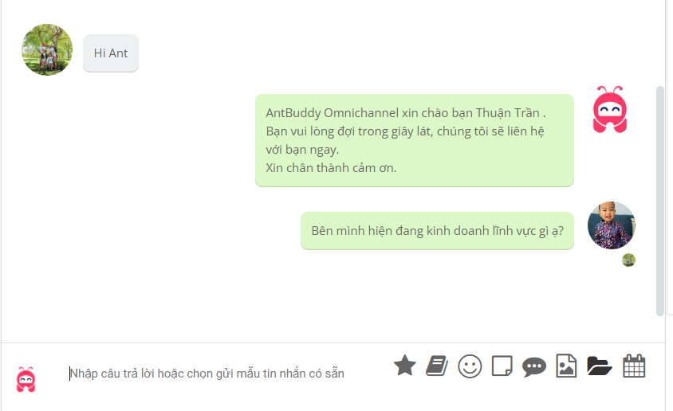{width="4.328125546806649in"
height="2.645764435695538in"}

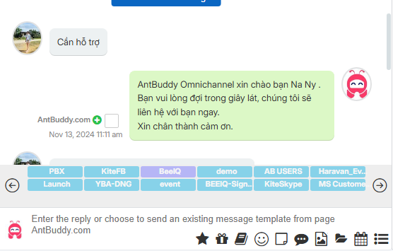{width="4.442708880139983in"
height="2.836030183727034in"}

Có thể lọc nhanh danh sách tin nhắn mẫu theo nội dung hoặc theo Danh mục

*(You can quickly filter the list of message templates by content or by
category.)*

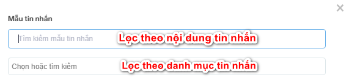{width="5.895833333333333in"
height="1.4270833333333333in"}

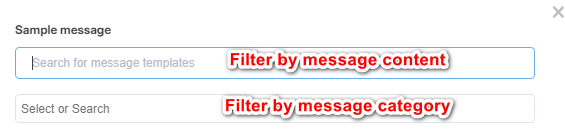{width="5.885416666666667in"
height="1.4270833333333333in"}

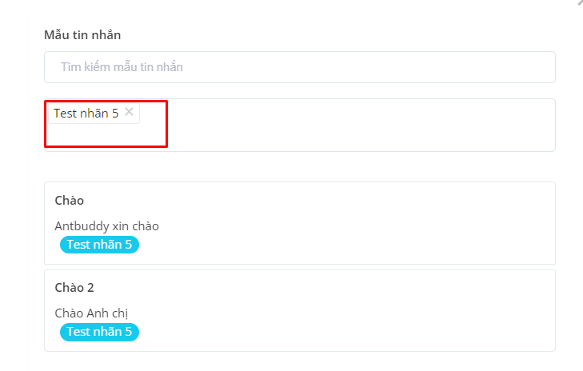{width="5.109375546806649in"
height="3.250648512685914in"}

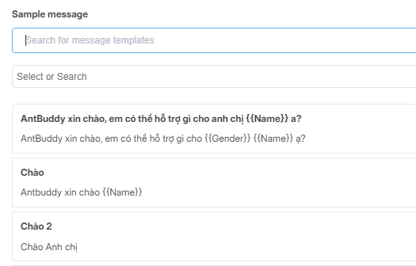{width="5.213542213473316in"
height="3.3366666666666664in"}

# 12. Hướng dẫn thiết lập thời gian đóng session? {#hướng-dẫn-thiết-lập-thời-gian-đóng-session .unnumbered}

# *(Guide to Setting Up Session Timeout)* {#guide-to-setting-up-session-timeout .unnumbered}

Tính năng này cho phép hệ thống kiểm tra và đóng session tự động sau
thời gian thiết lập kể từ tin nhắn cuối cùng của nhân viên.

*(This feature allows the system to automatically check and close the
session after the set time, starting from the last message sent by the
employee.)*

Bước 1: Trên thanh menu trái, click **Thiết lập**

*(Step 1: On the left menu bar, click Settings.)*

Bước 2: Click nút **Hội thoại đa kênh**

*(Step 2: Click the Omni-channel Conversations button.)*

Bước 3: Mở phần **Thiết lập khác**

*(Step 3: Open the Other Settings section.)*

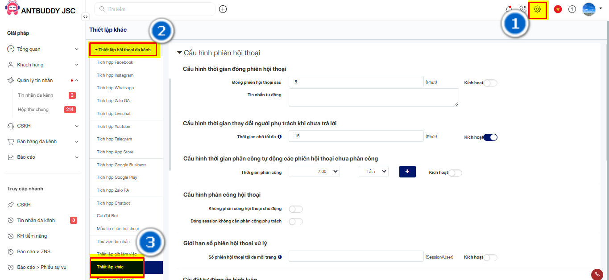{width="6.5in"
height="2.986111111111111in"}

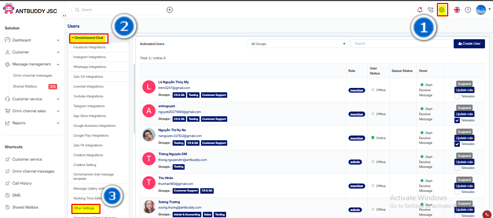{width="6.5in" height="2.875in"}

Bước 4: Nhập thời gian mong muốn, tin nhắn kết thúc session và bật kích
hoạt tính năng

*(Step 4: Enter the desired time, the session end message, and enable
the feature.)*

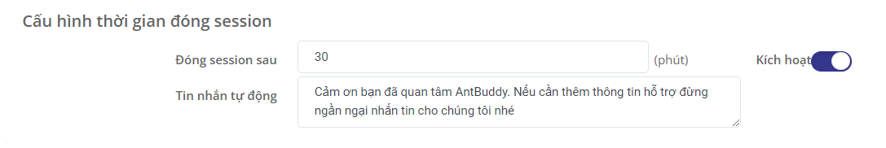{width="6.5in"
height="1.0833333333333333in"}

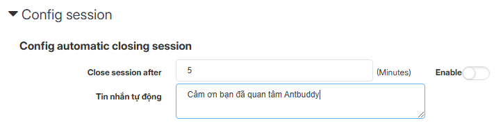{width="6.5in" height="1.625in"}

Ví dụ : với setting 30 phút, một session đang được hỗ trợ với tin nhắn
cuối là tin nhắn của nhân viên và trong vòng 30 phút session này không
có thêm tin nhắn nữa thì session đó sẽ được đóng tự động và gửi kèm lời
chào kết thúc session

*(For example: With a 30-minute setting, if a session is being supported
with the last message sent by the employee, and no further messages are
received within 30 minutes, the session will automatically close and
send a farewell message to end the session.)*

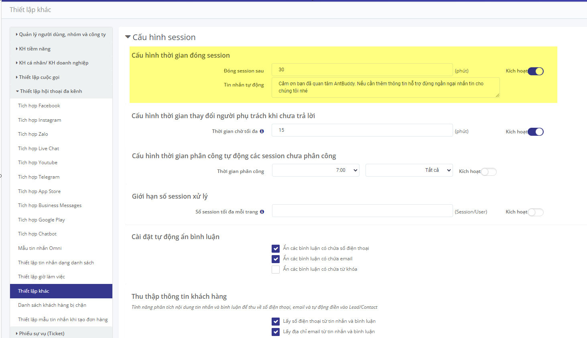{width="5.994792213473316in"
height="3.458533464566929in"}

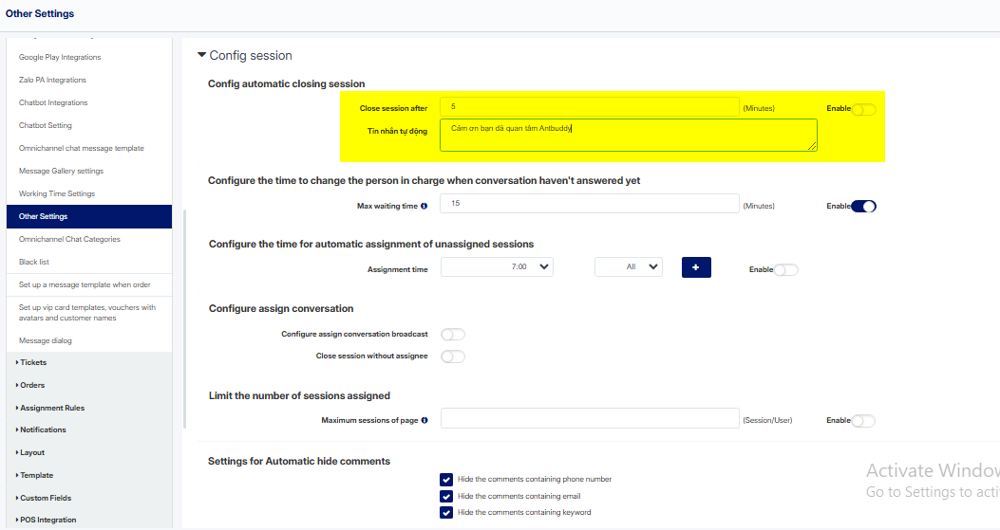{width="6.5in"
height="3.4444444444444446in"}

Bước 5. Kéo trang thiết lập xuống dưới cùng và Click **Lưu**

*(Step 5: Scroll down to the bottom of the settings page and click
Save.)*

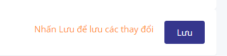{width="4.041666666666667in"
height="1.0104166666666667in"}

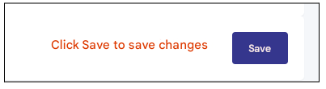{width="4.067708880139983in"
height="1.124663167104112in"}

# 13. Hướng dẫn cấu hình thời gian chờ thay đổi người phụ trách khi chưa trả lời session:  {#hướng-dẫn-cấu-hình-thời-gian-chờ-thay-đổi-người-phụ-trách-khi-chưa-trả-lời-session .unnumbered}

## *(Guide to Configuring the Timeout for Changing the Assignee When There Is No Response to the Session)* {#guide-to-configuring-the-timeout-for-changing-the-assignee-when-there-is-no-response-to-the-session .unnumbered}

Sau khoảng thời gian thiết lập, nếu agent được assign không trả lời thì
session tự động assign cho agent khác theo quy luật phân công

*(After the set timeout period, if the assigned agent does not respond,
the session will automatically be reassigned to another agent according
to the assignment rules.)*

Bước 1: Vào **Setting**

*(Step 1: Go to setting)*

Bước 2: Chọn **Omni**

*(Step 2: Select omni)*

Bước 3: Chọn **Thiết lập khác**

*(Step 3: Select Other Settings.)*

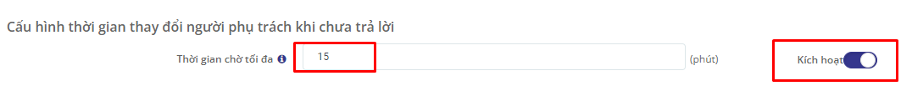{width="6.5in"
height="0.6944444444444444in"}

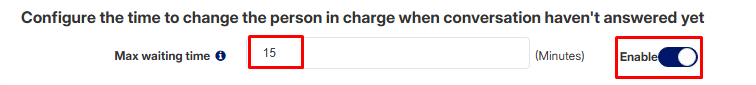{width="6.671875546806649in"
height="0.7639555993000875in"}

Bước 4: Nhập Thời gian chờ tối đa của session mong muốn (phút)

*(Step 4: Enter the desired maximum session timeout (in minutes).)*

Bước 5: Kích hoạt

*(Step 5: Enable the feature.)*

# 14. Hướng dẫn Thiết lập tự động trả lời và gửi tin nhắn trên FB {#hướng-dẫn-thiết-lập-tự-động-trả-lời-và-gửi-tin-nhắn-trên-fb .unnumbered}

# *(Guide to Setting Up Auto-Reply and Sending Messages on Facebook)y* {#guide-to-setting-up-auto-reply-and-sending-messages-on-facebooky .unnumbered}

Tính năng này cho phép người dùng thiết lập tính năng tự động trả lời
bình luận trên fanpage, cho phép gửi tin nhắn tự động theo mẫu tạo sẵn.
Để thiết lập tính năng, người dùng làm theo các bước sau:

*(This feature allows users to set up automatic replies to comments on
their Facebook fanpage and send automatic messages based on pre-created
templates. To set up this feature, follow these steps:)*

**Bước 1:** Vào **Setting** -\> **Omni** -\> **Tích hợp Facebook**

*(Step 1: Go to Settings -\> Omni -\> Facebook Integration)*

**Bước 2:** Chọn fanpage muốn thiết lập -\> **Cài Đặt**

*(Step 2: Select the fanpage you want to set up -\> Settings)*

**Bước 3:** Vào **Tương tác** và bật tính năng **Trả lời bình luận băng
bình luận**

*(Step 3: Go to Interactions and enable the Auto-Reply to Comments
feature.)*

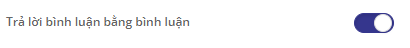{width="4.270833333333333in"
height="0.5in"}

{width="4.40625in"
height="0.5104166666666666in"}

Sau khi bật tính năng sẽ xuất hiện 2 loại cấu hình:

*(After enabling the feature, two types of configurations will appear:)*

-   **Cấu hình trả lời bình luận bằng bình luận:** Bot trả lời bình luận
    khi khách hàng bình luận vào fanpage

> *(Comment Reply by Comment Configuration: The bot will reply to a
> customer\'s comment when they comment on the fanpage.)*

-   **Cấu hình trả lời bình luận bằng tin nhắn:** Bot tự động nhắn tin
    với khách hàng khi họ bình luận vào fanpage

> *(Comment Reply by Message: The bot automatically sends a message to
> the customer when they comment on the fanpage.)*

**1. Cấu hình trả lời bình luận bằng bình luận:** Có 2 lựa chọn cấu hình

*(Comment Reply by Comment: There are two configuration options:)*

1.1. **Tất cả bài post:** Tại đây chúng ta có 2 cách để thiết lập bình
luận trả lời bình luận của khách hàng

*(1.1. All Posts: Here, you can set up the bot to reply to customer
comments in two ways:)*

1.1.1: Nội dung bất kì: Khi khách hàng nhập nội dung bất kì, thì hệ
thống tự động trả lời lại bình luận của khách hàng

*(1.1.1. Any content: When a customer enters any content, the system
will automatically reply to their comment.)*

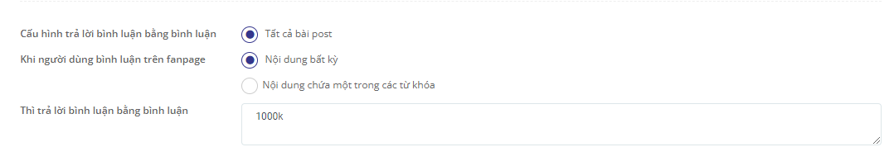{width="6.5in"
height="1.0694444444444444in"}

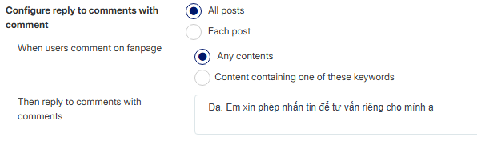{width="6.208333333333333in"
height="1.8854166666666667in"}

1.1.2: Nội dung chứa từ khóa: Khi khách hàng bình luận nội dung chứa các
từ khóa được thiết lập, thì hệ thống tự động trả lời lại bình luận của
khách hàng.

*(**Content containing keywords**: When a customer comments with content
containing the predefined keywords, the system will automatically reply
to their comment.)*

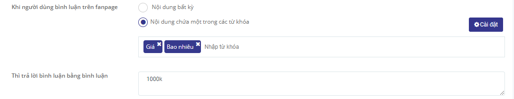{width="6.5in" height="1.25in"}

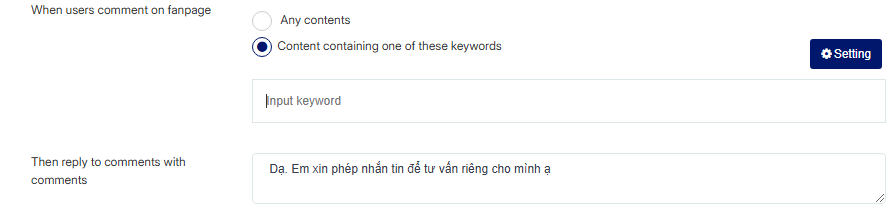{width="6.5in"
height="1.5416666666666667in"}

Lúc này người dùng có thể lựa chọn thêm cài đặt cho từ khóa bằng cách
bấm nút Cài đặt, sẽ có 3 thiết lập cho từ khóa được hiển thị.

*(At this point, users can choose additional settings for the keywords
by clicking the **Settings** button. Three configuration options for the
keywords will be displayed.)*

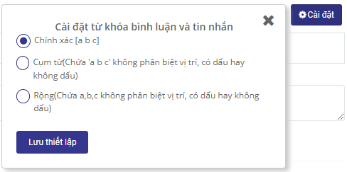{width="5.083333333333333in"
height="2.53125in"}

{width="5.25in" height="2.65625in"}

Bạn có thể chọn các chế độ khác nhau cho từ khóa bình luận bao gồm:

*(You can choose different modes for the comment keywords, including:)*

\+ Chính xác \[a b c\]: khách hàng cần gõ chính xác 100% từ khóa được
cài đặt bot sẽ ghi nhận và trả lời theo nội dung đã cài đặt. Chế độ này
không phân biệt chữ hoa, chữ thường, có phân biệt có dấu hay không dấu.

*(Exact \[a b c\]: The customer needs to type the keyword exactly as
configured for the bot to recognize and reply based on the pre-set
content. This mode does not distinguish between uppercase and lowercase
letters, and it does not differentiate between accented and non-accented
characters.)*

\+ Cụm từ (chứa \[a b c\]): khách hàng gõ nội dung chứa từ khóa được cài
đặt bot sẽ ghi nhận là từ khóa và trả lời theo nội dung đã cài đặt. Chế
độ này không phân biệt chữ hoa, chữ thường, có dấu hay không dấu.

*(**Phrase (contains \[a b c\])**: When the customer types content
containing the configured keyword, the bot will recognize it as a
keyword and reply based on the pre-set content. This mode does not
distinguish between uppercase and lowercase letters, and it does not
differentiate between accented and non-accented characters.)*

\+ Rộng (chứa \[a\] hoặc \[b\] hoặc \[c\]): khách hàng gõ nội dung chứa
1 trong các phần tử của từ khóa bot sẽ ghi nhận là từ khóa và trả lời
theo nội dung đã cài đặt. Chế độ này không phân biệt chữ hoa, chữ
thường, có dấu hay không dấu.

*(**Broad (contains \[a\] or \[b\] or \[c\])**: When the customer types
content containing any of the elements from the keywords, the bot will
recognize it as a keyword and reply based on the pre-set content. This
mode does not distinguish between uppercase and lowercase letters, and
it does not differentiate between accented and non-accented
characters.)*

Ví dụ:

*(Example:)*

Từ khóa cài đặt: inbox mình nhé

(*Configured keyword: inbox me)*

\> Chế độ chính xác: inbox mình nhé

*(Exact Mode: inbox me)*

\> Chế độ cụm từ: bạn ơi inbox mình nhé bạn (chứa inbox mình nhé)

*(Phrase Mode: \"Hey, inbox me please\" (contains \"inbox me\"))*

\> Chế độ rộng: shop em check inbox em với ạ (chứa inbox)

*(Broad Mode: \"Shop, please check your inbox\" (contains \"inbox\"))*

1.2. Theo từng post: Áp dụng mỗi post là 1 câu trả lời bình luận khác
nhau

*(Per Post: Apply a different reply to comments for each individual
post.)*

Bước 1: Vào Omni -\> Facebook

*(Step 1: Go to Omni -\> Facebook.)*

**Bước 2:** Vào bộ lọc để lọc Bài viết

*(Step 2: Go to the **filter** to filter the posts.)\
*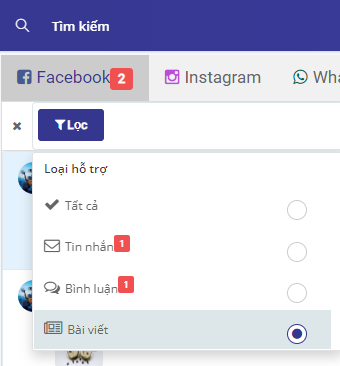{width="3.5416666666666665in"
height="3.8125in"}

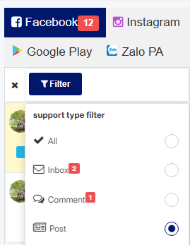{width="3.526042213473316in"
height="4.219091207349082in"}

**Bước 3**: Nhấp vào bài viết cần thiết lập

*(Step 3: Click on the post you want to set up.)*

**Bước 4:** Nhấn vào {width="0.40625in"
height="0.4270833333333333in"}

*(Step 4: Click on Settings*
{width="0.40625in"
height="0.4270833333333333in"} *.)*

**Bước 5:** Lúc này giao diện sẽ xuất hiện popup với các thiết lập tương
tự như cấu hình cho tất cả bài viết

*(Step 5: A popup will appear with settings similar to the configuration
for all posts.)*

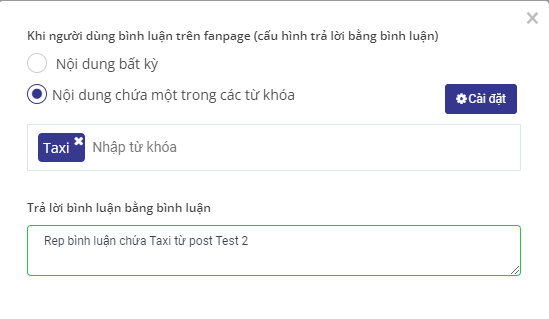{width="4.235563210848644in"
height="2.463542213473316in"}

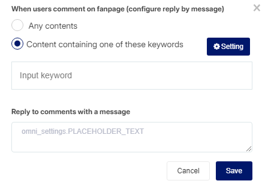{width="4.046875546806649in"
height="3.0021653543307085in"}

**2. Cấu hình trả lời bình luận bằng tin nhắn:** Có 2 lựa chọn cấu hình

*(Comment Reply by Message Configuration: There are 2 configuration
options:)*

2.1 **Tất cả bài post:** Tại đây chúng ta có 2 cách để thiết lập trả lời
bình luận bằng tin nhắn

*(All Posts: Here, you can set up two ways to reply to comments via
message:)*

2.1.1: Nội dung bất kì: Khi khách hàng nhập nội dung bất kì, thì hệ
thống tự động trả lời lại bình luận của khách hàng bằng tin nhắn được
thiết lập

*( Any Content: When the customer enters any content, the system will
automatically reply to their comment with a pre-configured message.)*

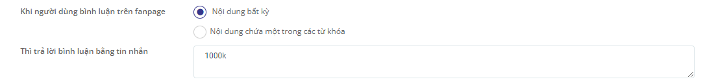{width="6.456666666666667in"
height="0.7760422134733158in"}

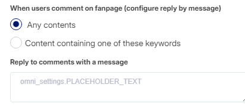{width="3.8489588801399823in"
height="1.6887412510936133in"}

2.1.2: Nội dung chứa từ khóa: Khi khách hàng bình luận nội dung chứa các
từ khóa được thiết lập, thì hệ thống tự động trả lời lại bình luận của
khách hàng

*( Content containing keywords: When a customer comments with content
containing the predefined keywords, the system will automatically reply
to their comment with the pre-configured message.)*

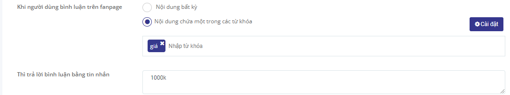{width="6.5in"
height="1.2222222222222223in"}

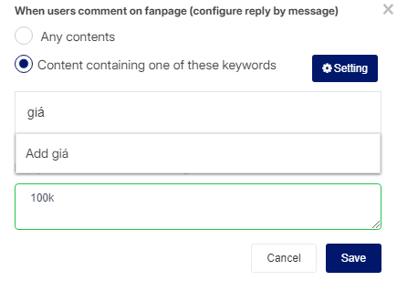{width="4.53125in"
height="3.2083333333333335in"}

Thiết lập cài đặt cho từ khóa tương tự như ở phần trả lời bình luận bằng
bình luận

*(The keyword settings are configured similarly to the Comment Reply by
Comment section.)*

2.2. **Theo từng post:** Áp dụng mỗi post là 1 mẫu tin nhắn khác nhau

*(Per Post: Apply a different message template for each post.)*

**Bước 1:** Vào Omni -\> Facebook

*(Step 1: Go to Omni -\> Facebook)*

**Bước 2:** Vào bộ lọc để lọc Bài viết

*(Step 2: Go to the filter to filter the posts.)\
*{width="3.5416666666666665in"
height="3.8125in"}

{width="3.526042213473316in"
height="4.219091207349082in"}

**Bước 3**: Nhấp vào bài viết cần thiết lập

*(Step 3: Click on the post you want to set up.)*

**Bước 4:** Nhấn vào {width="0.40625in"
height="0.4270833333333333in"}

*(Step 4: Click on Settings*
{width="0.40625in"
height="0.4270833333333333in"}*.)*

**Bước 5:** Lúc này giao diện sẽ xuất hiện popup với các thiết lập tương
tự như cấu hình cho tất cả bài viết

*(Step 5: A popup will appear with settings similar to the configuration
for all posts.)*

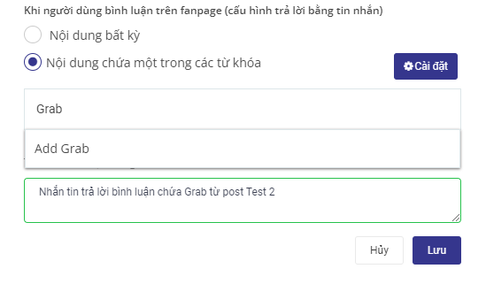{width="5.71875in" height="3.34375in"}

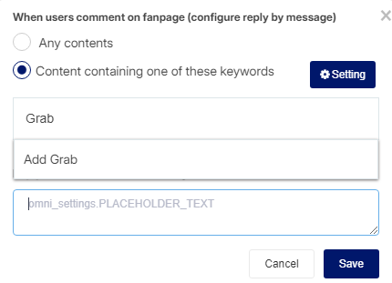{width="4.479166666666667in"
height="3.2395833333333335in"}

# 15. Hướng dẫn **Thiết lập thời hạn phản hồi và cảnh báo trước khi hết hạn phản hồi cho session Omni** {#hướng-dẫn-thiết-lập-thời-hạn-phản-hồi-và-cảnh-báo-trước-khi-hết-hạn-phản-hồi-cho-session-omni .unnumbered}

# *(Guide to Setting Up Response Time and Pre-Expiration Warnings for Omni Sessions)* {#guide-to-setting-up-response-time-and-pre-expiration-warnings-for-omni-sessions .unnumbered}

Tính năng này cho phép:

*(This feature allows you to:)*

-   Thiết lập thời hạn phản hồi cho session Omni *(1)*. Ví dụ thiết lập
    30 phút, thì sau 30 phút nhân viên không phản hồi, session được xem
    là quá hạn phản hồi

> *(Set a response deadline for Omni sessions (1). For example, if you
> set it to 30 minutes, the session will be considered overdue if the
> employee does not respond within 30 minutes.)*

-   Thiết lập cảnh báo trước khi hết thời hạn phản hồi *(2)*. Ví dụ
    thiết lập 5 phút, thì trước khi hết thời hạn phản hồi ở *(1)* 5
    phút, nhân viên phụ trách sẽ nhận được thông báo cảnh báo session
    sắp hết hạn

> *(Set a pre-expiration warning (2). For example, if you set it to 5
> minutes, the assigned employee will receive a warning notification 5
> minutes before the response deadline expires.)*

**1/ Để thực hiện thiết lập người dùng làm theo các bước sau:**

*(To set this up, follow these steps:)*

**Bước 1:** Vào **Setting** -\> **Omni** -\> **Thiết lập khác**

*(Step 1: Go to Settings -\> Omni -\> Other Settings)*

**Bước 2:** Vào **Cấu hình session** -\> **Cấu hình thời hạn phản hồi**

*(Step 2: Go to Session Configuration -\> Response Deadline
Configuration)*

**Bước 3:** Nhập thời gian cho **Thời hạn phản hồi session** và **Cảnh
báo trước khi hết hạn**

*(Step 3: Enter the time for the Session Response Deadline and
Pre-Expiration Warning)*

**Bước 4:** Chọn **Kích Hoạt**

*(Step 4: Select Activate)*

**Bước 5: Lưu**

*(Step 5: Click Save)*

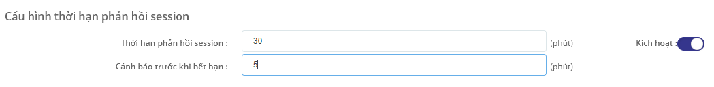{width="6.5in"
height="0.8055555555555556in"}

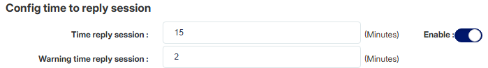{width="6.5in"
height="0.9166666666666666in"}

**2/ Giao diện hiển thị trên hệ thống**

*(Display Interface on the System)*

Khi session quá thời hạn thiết lập ở *(1)*, sẽ hiển thị giao diện quá
hạn

*(When the session exceeds the time limit set in (1), an expired
interface will be displayed.\")*

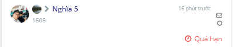{width="4.1875in"
height="0.8541666666666666in"}

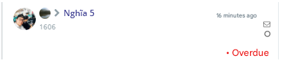{width="4.197916666666667in"
height="0.96875in"}

Khi session tới hạn thiết lập ở *(2)*, sẽ hiển thị giao diện sắp quá
hạn: thời gian của session sẽ tô đỏ

*(When the session reaches the time limit set in (2), an interface
indicating it is about to expire will be displayed: the session time
will be highlighted in red.)*

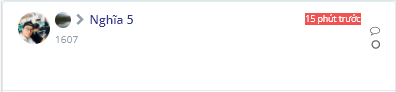{width="4.125in"
height="0.9583333333333334in"}

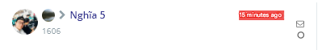{width="4.322916666666667in"
height="0.6927088801399826in"}

**3/ Lưu ý:**

*(Notes:)*

-   Session chỉ bắt đầu đếm thời gian quá hạn sau khi được phân công cho
    nhân viên

> *(The session will only start counting the expiration time after it
> has been assigned to an employee.)*

-   Trong khoảng thời gian chưa quá hạn, khi nhân viên phản hồi cho
    session, thì session sẽ mất thông báo quá hạn

> *(Within the time frame before expiration, when the employee responds
> to the session, the expiration notification will be removed.)*

-   Có bộ lọc tin Quá Hạn cho session chưa xong

> *(There is a filter for \'Expired\' messages for sessions that are not
> yet completed.)*

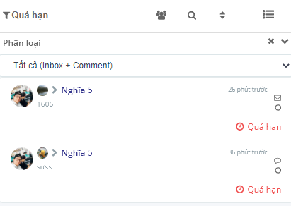{width="4.28125in"
height="3.0416666666666665in"}

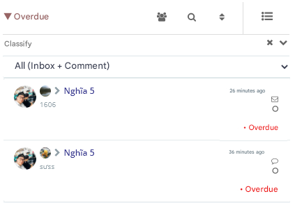{width="4.40625in"
height="3.0416666666666665in"}

# 16. Các thao tác với khách hàng {#các-thao-tác-với-khách-hàng .unnumbered}

# *(Customer operations)* {#customer-operations .unnumbered}

Xem hướng dẫn các thao tác với khách hàng như chỉnh sửa thông tin khách
hàng, thêm ticket, nhiệm vụ liên quan [[tại
đây]{.underline}](https://docs.google.com/document/d/15uPmi4DaFvESSU9Vn9E1IJWrPB3fENf7BAuQ3UqsfJM/edit#heading=h.8vie7jtm29xs)

*(View the guide for customer operations such as editing customer
information, adding tickets, and related tasks
[[here]{.underline}](https://docs.google.com/document/d/15uPmi4DaFvESSU9Vn9E1IJWrPB3fENf7BAuQ3UqsfJM/edit?usp=sharing).)*

# 17. Hướng dẫn đánh dấu chưa đọc {#hướng-dẫn-đánh-dấu-chưa-đọc .unnumbered}

#  *(Guide to marking as unread)* {#guide-to-marking-as-unread .unnumbered}

Bước 1: Tại hộp thư thoại, di chuyển chuột vào đoạn chat, icon
{width="0.3958333333333333in"
height="0.4479166666666667in"} sẽ hiển thị

*(Step 1: In the voicemail box, hover over the chat, and the icon*
{width="0.3958333333333333in"
height="0.4479166666666667in"} *will appear.)*

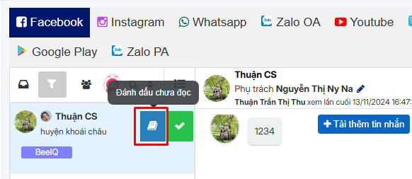{width="5.324735345581802in"
height="2.3177088801399823in"}

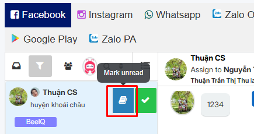{width="5.401042213473316in"
height="2.8608847331583553in"}

Bước 2: Click chuột vào icon
{width="0.3958333333333333in"
height="0.4479166666666667in"} để đánh dấu chưa đọc đoạn chat

*(Click the
icon*{width="0.3958333333333333in"
height="0.4479166666666667in"} *to mark the chat as unread.)*

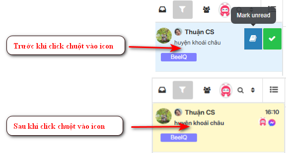{width="6.0in" height="3.21875in"}

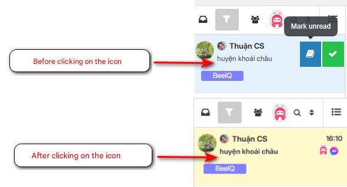{width="6.145833333333333in"
height="3.3229166666666665in"}

# 18. Hướng dẫn thiết lập **Danh mục hội thoại** {#hướng-dẫn-thiết-lập-danh-mục-hội-thoại .unnumbered}

#  *(Guide to setting up Omnichannel chat Categories)* {#guide-to-setting-up-omnichannel-chat-categories .unnumbered}

Tính năng này cho phép người dùng thiết lập danh mục hội thoại

*(This feature allows user to set up Omnichannel chat Categories)*

Bước 1: Trên thanh menu trái, click **Thiết lập**

*(Step 1: On the left menu bar, click Settings.)*

Bước 2: Click nút **Hội thoại đa kênh**

*(Step 2: Click the Omni-channel Conversations button.)*

Bước 3: Mở phần **danh mục hội thoại**

*(Step 3: Open the Omnichannel chat Categories.)*

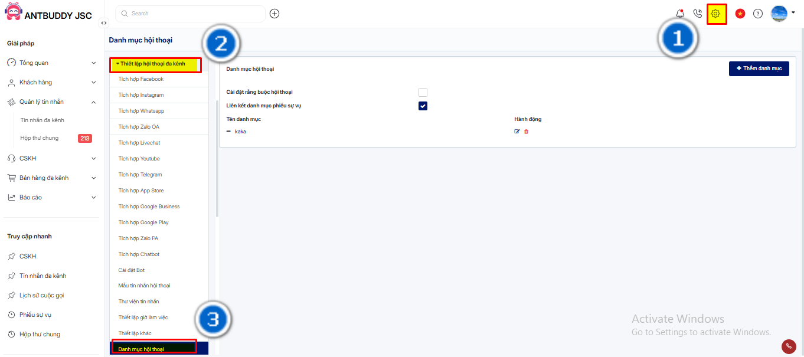{width="6.5in"
height="2.888888888888889in"}

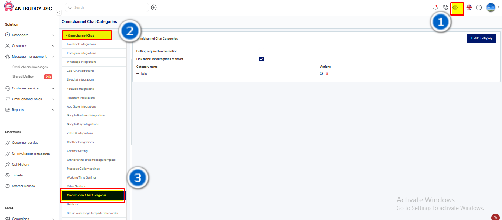{width="6.5in"
height="2.8472222222222223in"}

Bước 4: Chọn **thêm danh mục**

*(Select Add Category)*

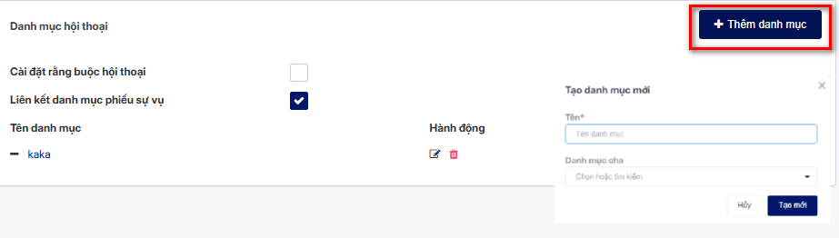{width="6.5in"
height="1.8472222222222223in"}

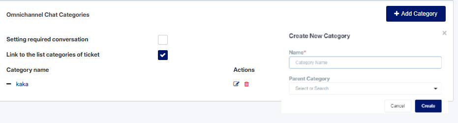{width="6.5in" height="1.75in"}

Bước 5: Cập nhật tên danh mục

*(Update category name)*

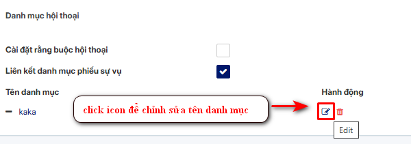{width="6.25in"
height="2.1979166666666665in"}

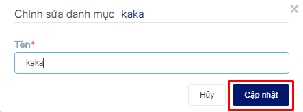{width="5.526042213473316in"
height="2.045757874015748in"}

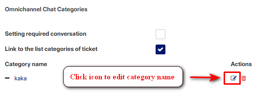{width="5.854166666666667in"
height="2.0208333333333335in"}

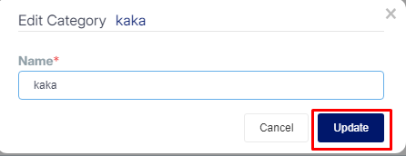{width="5.203125546806649in"
height="2.006586832895888in"}

Bước 6: Xóa tên danh mục

*(Delete category name)*

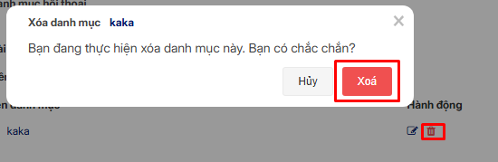{width="5.729166666666667in"
height="1.8645833333333333in"}

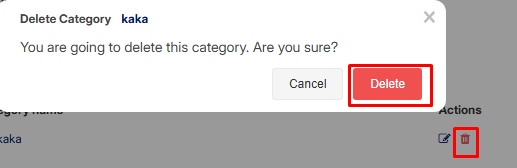{width="5.734375546806649in"
height="1.8633945756780403in"}

# 19. Hướng dẫn cấu hình [Cấu hình hiển thị]{.mark} {#hướng-dẫn-cấu-hình-cấu-hình-hiển-thị .unnumbered}

#  *(Guide to configuring layout)* {#guide-to-configuring-layout .unnumbered}

Tính năng này cho phép người dùng thiết lập cấu hình hiển thị

*(This feature allows user to set up configuring layout)*

Bước 1: Trên thanh menu trái, click **Thiết lập**

*(Step 1: On the left menu bar, click Settings.)*

Bước 2: Click nút **Hội thoại đa kênh**

*(Step 2: Click the Omni-channel Conversations button.)*

Bước 3: Mở phần **thiết lập khác**

*(Step 3: Open the other settings session.)*

Bước 4: Chọn **cấu hình hiển thị**

*(Step 4: Select Config layout)*

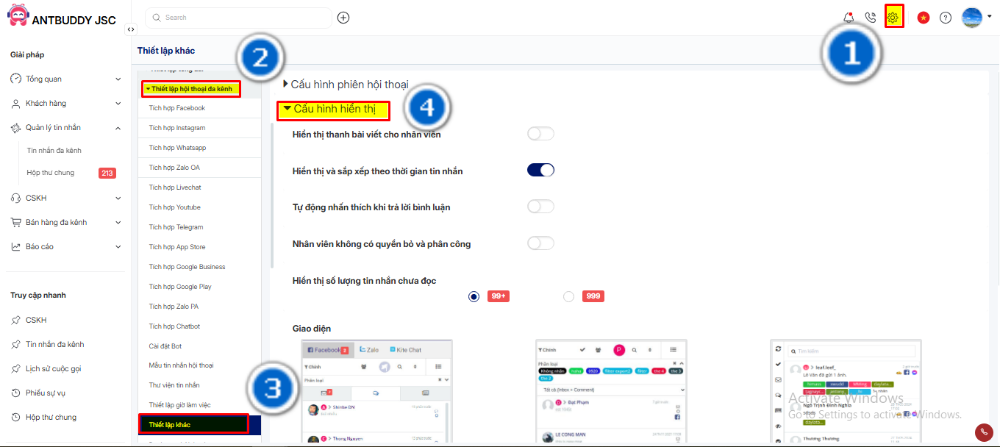{width="6.5in"
height="2.9027777777777777in"}

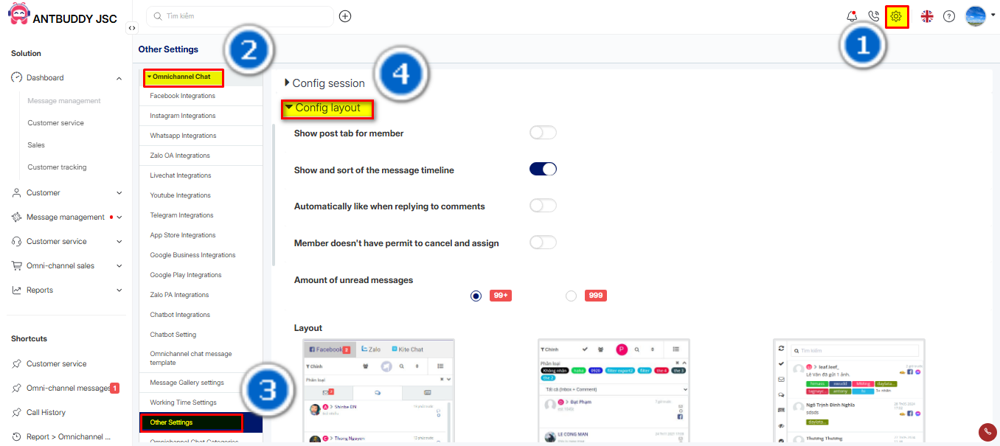{width="6.5in"
height="2.9027777777777777in"}

Bước 5: Tại giao diện cấu hình hiển thị, có thể bật/tắt kích hoạt tính
năng

*(Step 5: At config layout interface, can enable or disable the
feature.)*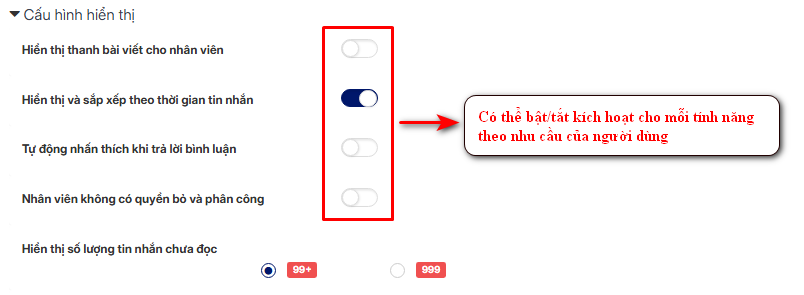{width="6.5in"
height="2.388888888888889in"}

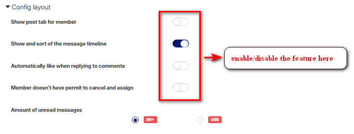{width="6.5in"
height="2.4722222222222223in"}

Bước 6: Chọn giao diện

*(Step 6: Select interface)*

Có 3 cấu hình để lựa chọn:

*(There are 3 interfaces to choose:)*

-   Mặc định

> *(Default)*

-   Hợp nhất

> *(Unify)*

-   Hiệu năng

> *(Performance)*

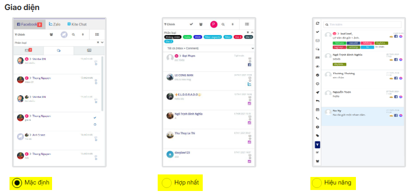{width="6.5in" height="3.0in"}

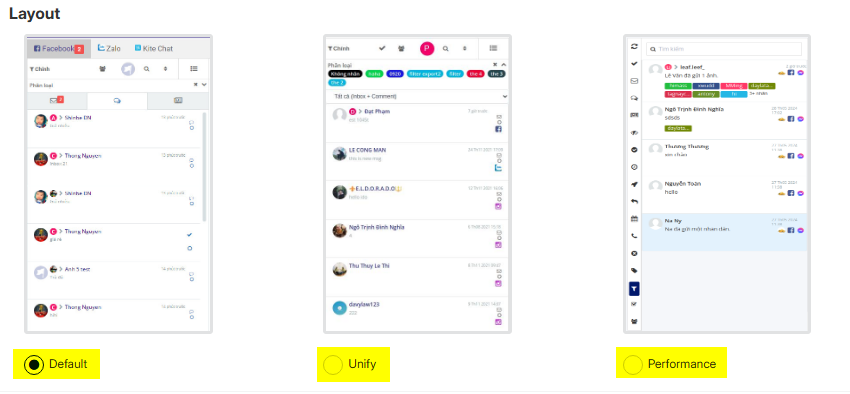{width="6.5in"
height="3.013888888888889in"}
